# eventbus-rs

Async **event bus** for Rust: typed events, NATS JetStream transport, transactional Postgres outbox, and a SQLite fallback buffer for offline publishing — built on a trait-only core so applications stay decoupled from any single transport.

**License:** MIT OR Apache-2.0
**Repository:** [github.com/1hoodlabs/eventbus-rs](https://github.com/1hoodlabs/eventbus-rs)

---

## Overview

This workspace ships four crates that compose into a full event-bus stack:

- **`bus-core`** — trait-only contracts (`Event`, `Publisher`, `EventHandler`, `IdempotencyStore`), `MessageId` (UUIDv7), and structured `BusError` / `HandlerError`. No transport dependencies.
- **`bus-macros`** — `#[derive(Event)]` with compile-time `subject` template validation and `{self.field}` interpolation.
- **`bus-nats`** — NATS JetStream `Publisher` implementation, pull-consumer subscriber, and idempotency stores backed by NATS KV (default) or Redis (`redis-inbox` feature).
- **`bus-outbox`** — transactional outbox dispatcher with `PostgresOutboxStore` + `PostgresIdempotencyStore` (default), and a `SqliteBuffer` fallback (`sqlite-buffer` feature) for relaying messages when NATS is unreachable.

The architecture diagram below depicts the **v1.0 target** (including the `event-bus` facade, saga engine, and `bus-telemetry` crates which are still on the roadmap). Status of each component is called out in [Implementation status](#implementation-status).

---

## Architecture

Full v1.0 component interaction diagram — showing every crate, their internal components, and runtime data flows (publish, outbox dispatch, consume, telemetry):

```mermaid
graph TB
    %% ── Application (library consumer) ──────────────────────────────
    subgraph app["Application"]
        APP_CODE["Application Code\n─────────────\npublish_in_tx()\nsubscribe()\nstart_saga()"]
        APP_TX["Postgres Transaction\n─────────────\nBusiness write +\noutbox insert (atomic)"]
    end

    %% ── event-bus facade ─────────────────────────────────────────────
    subgraph event_bus["event-bus — Public Facade"]
        EB_BUILDER["EventBusBuilder\n─────────────\nurl · idempotency (required)\noutbox · sqlite_buffer\nwith_otel"]
        EB_BUS["EventBus\n─────────────\npublish()\npublish_in_tx()\nsubscribe()\nshutdown()"]
        EB_SAGA["Saga Engine\n─────────────\nChoreographyStep\nSagaDefinition\nSagaHandle"]
        EB_PRELUDE["prelude.rs\n─────────────\nre-exports all\npublic API types"]
    end

    %% ── bus-core ─────────────────────────────────────────────────────
    subgraph bus_core["bus-core — Traits & Types"]
        BC_EVENT["Event trait\n─────────────\nsubject()\nmessage_id()\naggregate_type()"]
        BC_PUB["Publisher trait\n─────────────\npublish()\npublish_batch()"]
        BC_HANDLER["EventHandler trait\n─────────────\nhandle(ctx, event)"]
        BC_IDEM["IdempotencyStore trait\n─────────────\ntry_insert()\nmark_done()"]
        BC_MSGID["MessageId\n─────────────\nUUIDv7 newtype\nOrd · Hash · Serde"]
        BC_ERR["BusError / HandlerError\n─────────────\nTransient → NAK retry\nPermanent → Term DLQ"]
        BC_CTX["HandlerCtx\n─────────────\nmsg_id · stream_seq\ndelivered · span"]
        BC_RECEIPT["PubReceipt\n─────────────\nstream · sequence\nduplicate · buffered"]
    end

    %% ── bus-macros ───────────────────────────────────────────────────
    subgraph bus_macros["bus-macros — Proc Macro"]
        BM_DERIVE["#[derive(Event)]\n─────────────\nsubject template\nfield interpolation\ncompile-time validation"]
    end

    %% ── bus-nats ─────────────────────────────────────────────────────
    subgraph bus_nats["bus-nats — JetStream Backend"]
        BN_CLIENT["NatsClient\n─────────────\nconnect()\nensure_stream()"]
        BN_PUB["NatsPublisher\n─────────────\nimpl Publisher\nNats-Msg-Id header"]
        BN_SUB["subscriber.rs\n─────────────\npull consumer loop\nsemaphore concurrency"]
        BN_ACK["ack.rs\n─────────────\ndouble_ack()\nnak_with_delay()\nterm()"]
        BN_CB["CircuitBreaker\n─────────────\nsliding window\nClosed/Open/HalfOpen"]
        BN_DLQ["dlq.rs\n─────────────\nrepublish on\nMAX_DELIVERIES advisory"]
        BN_KV["NatsKvIdempotencyStore\n─────────────\nKV.Create (atomic)\nbucket: eventbus_processed"]
        BN_REDIS["RedisIdempotencyStore\n─────────────\nSET NX EX (atomic)\nfeature: redis-inbox"]
    end

    %% ── bus-outbox ───────────────────────────────────────────────────
    subgraph bus_outbox["bus-outbox — Outbox + Buffer"]
        BO_STORE["OutboxStore trait\n─────────────\ninsert() · fetch_pending()\nmark_published() · mark_failed()"]
        BO_PG["PostgresOutboxStore\n─────────────\nimpl OutboxStore\nfeature: postgres-outbox"]
        BO_DISP["OutboxDispatcher\n─────────────\npoll every 250ms\nSELECT FOR UPDATE\nSKIP LOCKED LIMIT 100"]
        BO_IDEM_PG["PostgresIdempotencyStore\n─────────────\nINSERT ON CONFLICT DO NOTHING\nfeature: postgres-inbox"]
        BO_SQLITE["SqliteBuffer\n─────────────\nNATS-down fallback\nrelay on recovery\nfeature: sqlite-buffer"]
        BO_MIGRATE["migrate.rs\n─────────────\noutbox · inbox\nsagas migrations"]
    end

    %% ── bus-telemetry ────────────────────────────────────────────────
    subgraph bus_telemetry["bus-telemetry — OTel (feature: otel)"]
        BT_INJECT["inject_context()\n─────────────\nW3C traceparent\n→ NATS header"]
        BT_EXTRACT["extract_context()\n─────────────\nNATS header\n→ parent span"]
        BT_SPANS["Auto spans\n─────────────\npublish · receive\nhandle · dispatch\nidempotency check"]
        BT_METRICS["Metrics\n─────────────\npublish.total\nconsume.total\noutbox.pending\ndlq.total"]
    end

    %% ── External Systems ─────────────────────────────────────────────
    subgraph ext["External Systems"]
        EXT_NATS[("NATS JetStream\nR3 · dedup 5min\nFileStorage")]
        EXT_PG[("PostgreSQL\neventbus_outbox\neventbus_inbox\neventbus_sagas")]
        EXT_SQLITE[("SQLite\neventbus_buffer\nlocal fallback")]
        EXT_OTEL[("OTel Collector\nJaeger / Prometheus\n/ OTLP")]
        EXT_REDIS[("Redis\nidempotency\nSET NX EX")]
    end

    %% COMPILE-TIME RELATIONSHIPS
    BM_DERIVE -.->|"generates impl"| BC_EVENT
    EB_BUILDER -->|"builds"| EB_BUS
    EB_BUS -->|"uses"| BC_PUB
    EB_BUS -->|"uses"| BC_IDEM
    EB_BUS -->|"uses"| BO_STORE
    EB_BUS -->|"uses"| EB_SAGA
    BN_PUB -.->|"impl"| BC_PUB
    BN_KV -.->|"impl"| BC_IDEM
    BN_REDIS -.->|"impl"| BC_IDEM
    BO_PG -.->|"impl"| BO_STORE
    BO_IDEM_PG -.->|"impl"| BC_IDEM

    %% RUNTIME: PUBLISH PATH (direct)
    APP_CODE -->|"publish(event)"| EB_BUS
    EB_BUS -->|"publish(event)"| BN_PUB
    BN_PUB -->|"check"| BN_CB
    BN_CB -->|"Closed: allow"| EXT_NATS
    BN_CB -->|"Open: buffer"| BO_SQLITE
    BO_SQLITE -->|"relay on recovery"| EXT_NATS
    BN_PUB -->|"inject traceparent"| BT_INJECT
    BT_INJECT -->|"header"| EXT_NATS

    %% RUNTIME: PUBLISH PATH (transactional outbox)
    APP_CODE -->|"publish_in_tx(tx, event)"| EB_BUS
    APP_CODE -->|"BEGIN / business write"| APP_TX
    EB_BUS -->|"insert outbox row"| APP_TX
    APP_TX -->|"COMMIT"| EXT_PG
    BO_DISP -->|"SELECT FOR UPDATE SKIP LOCKED"| EXT_PG
    BO_DISP -->|"publish_with_headers"| BN_PUB
    BO_DISP -->|"mark_published"| BO_PG
    BO_PG -->|"UPDATE published_at"| EXT_PG

    %% RUNTIME: CONSUME PATH
    EXT_NATS -->|"fetch batch"| BN_SUB
    BN_SUB -->|"extract traceparent"| BT_EXTRACT
    BT_EXTRACT -->|"parent span"| BT_SPANS
    BN_SUB -->|"try_insert(msg_id)"| BC_IDEM
    BC_IDEM -->|"false: duplicate"| BN_ACK
    BC_IDEM -->|"true: new"| BN_SUB
    BN_SUB -->|"handle(ctx, event)"| BC_HANDLER
    BC_HANDLER -->|"Ok → mark_done"| BC_IDEM
    BC_HANDLER -->|"Ok → double_ack"| BN_ACK
    BC_HANDLER -->|"Transient → nak_with_delay"| BN_ACK
    BC_HANDLER -->|"Permanent → term"| BN_ACK
    BN_ACK -->|"Term advisory"| BN_DLQ
    BN_DLQ -->|"republish to DLQ"| EXT_NATS
    BN_SUB -->|"emit spans + metrics"| BT_METRICS

    %% RUNTIME: TELEMETRY EXPORT
    BT_SPANS -->|"export"| EXT_OTEL
    BT_METRICS -->|"export"| EXT_OTEL

    %% EXTERNAL BACKEND CONNECTIONS
    BN_KV -->|"KV.Create"| EXT_NATS
    BN_REDIS -->|"SET NX EX"| EXT_REDIS
    BO_IDEM_PG -->|"INSERT ON CONFLICT"| EXT_PG
    BO_SQLITE -->|"INSERT / DELETE"| EXT_SQLITE
    BO_MIGRATE -->|"run migrations"| EXT_PG

    classDef coreStyle fill:#dbeafe,stroke:#3b82f6,color:#1e3a5f
    classDef natsStyle fill:#dcfce7,stroke:#16a34a,color:#14532d
    classDef outboxStyle fill:#fef9c3,stroke:#ca8a04,color:#78350f
    classDef facadeStyle fill:#f3e8ff,stroke:#9333ea,color:#3b0764
    classDef macroStyle fill:#fce7f3,stroke:#db2777,color:#831843
    classDef telemStyle fill:#ffedd5,stroke:#ea580c,color:#7c2d12
    classDef extStyle fill:#f1f5f9,stroke:#64748b,color:#0f172a
    classDef appStyle fill:#ecfdf5,stroke:#059669,color:#064e3b

    class BC_EVENT,BC_PUB,BC_HANDLER,BC_IDEM,BC_MSGID,BC_ERR,BC_CTX,BC_RECEIPT coreStyle
    class BN_CLIENT,BN_PUB,BN_SUB,BN_ACK,BN_CB,BN_DLQ,BN_KV,BN_REDIS natsStyle
    class BO_STORE,BO_PG,BO_DISP,BO_IDEM_PG,BO_SQLITE,BO_MIGRATE outboxStyle
    class EB_BUILDER,EB_BUS,EB_SAGA,EB_PRELUDE facadeStyle
    class BM_DERIVE macroStyle
    class BT_INJECT,BT_EXTRACT,BT_SPANS,BT_METRICS telemStyle
    class EXT_NATS,EXT_PG,EXT_SQLITE,EXT_OTEL,EXT_REDIS extStyle
    class APP_CODE,APP_TX appStyle
```



**Edge legend:** `-->` solid = runtime interaction · `-.->` dashed = compile-time (trait impl / code generation)

---

## Implementation status

| Component | Crate | Status |
|-----------|-------|--------|
| Traits, `MessageId`, errors | `bus-core` | Shipped |
| `#[derive(Event)]` macro | `bus-macros` | Shipped |
| NATS JetStream `Publisher` + subscriber | `bus-nats` | Shipped |
| NATS KV idempotency store | `bus-nats` (`nats-kv-inbox`, default) | Shipped |
| Redis idempotency store | `bus-nats` (`redis-inbox`) | Shipped |
| Postgres outbox + dispatcher | `bus-outbox` (`postgres-outbox`, default) | Shipped |
| Postgres idempotency store | `bus-outbox` (`postgres-inbox`, default) | Shipped |
| SQLite fallback buffer | `bus-outbox` (`sqlite-buffer`) | Shipped |
| `event-bus` facade + saga engine | `event-bus` | Planned |
| `bus-telemetry` (OTel spans + metrics) | `bus-telemetry` | Planned |

---

## Requirements

- **Rust toolchain:** **1.85.0** or newer (workspace uses **edition 2024**)
- **NATS** 2.10+ with JetStream enabled (for `bus-nats`)
- **PostgreSQL** 14+ (for `bus-outbox` Postgres features)
- A local `docker-compose.yml` is provided to spin up NATS + Postgres for development and integration tests.

---

## Workspace layout

| Crate        | Purpose |
|-------------|---------|
| [`bus-core`](crates/bus-core/)     | Traits and types shared by publishers and consumers (no transport deps) |
| [`bus-macros`](crates/bus-macros/) | Proc-macro `#[derive(Event)]` and `#[event(...)]` attributes |
| [`bus-nats`](crates/bus-nats/)     | NATS JetStream publisher, subscriber, ack/DLQ helpers, and KV/Redis idempotency stores |
| [`bus-outbox`](crates/bus-outbox/) | Transactional outbox + dispatcher, Postgres idempotency store, SQLite fallback buffer |

---

## Quick start

Add the crates you need to your `Cargo.toml` (paths shown for local development; published versions will use `version = "..."` from [crates.io](https://crates.io/) when available):

```toml
[dependencies]
bus-core   = { path = "crates/bus-core" }
bus-macros = { path = "crates/bus-macros" }

# Optional — NATS JetStream transport
bus-nats   = { path = "crates/bus-nats" }
# or with Redis-backed idempotency:
# bus-nats = { path = "crates/bus-nats", default-features = false, features = ["redis-inbox"] }

# Optional — transactional outbox + SQLite fallback
bus-outbox = { path = "crates/bus-outbox", features = ["sqlite-buffer"] }

serde = { version = "1", features = ["derive"] }
uuid  = { version = "1", features = ["v7"] }
```

### Defining an event

```rust
use bus_core::{Event, MessageId};
use bus_macros::Event;
use serde::{Deserialize, Serialize};

#[derive(Debug, Serialize, Deserialize, Event)]
#[event(subject = "orders.{self.order_id}.created")]
struct OrderCreated {
    id: MessageId,
    order_id: uuid::Uuid,
}

let event = OrderCreated {
    id: MessageId::new(),
    order_id: uuid::Uuid::now_v7(),
};

assert!(event.subject().contains("orders."));
```

The derive macro requires:

- `#[event(subject = "...")]` on the struct
- A field named `id` with type `bus_core::MessageId`

See integration tests under [`crates/bus-macros/tests/`](crates/bus-macros/tests/) for more examples and compile-fail coverage ([`trybuild`](https://github.com/dtolnay/trybuild)).

---

## Development

```bash
# Unit tests + clippy across the whole workspace
cargo test --workspace
cargo clippy --workspace --all-features -- -D warnings

# Integration tests for bus-nats / bus-outbox use testcontainers and require Docker
cargo test -p bus-nats
cargo test -p bus-outbox --features sqlite-buffer
```

A `docker-compose.yml` is included at the repo root to bring up NATS and Postgres locally if you prefer running tests against long-lived services.

---

## Contributing

Contributions are welcome.

1. **Issues first** for sizeable changes (API, new crates, behavior).
2. Keep **`bus-core`** free of transport-specific dependencies unless the project explicitly expands scope.
3. Match existing style; add or update tests when behavior changes (including `trybuild` snapshots under `crates/bus-macros/tests/compile_fail/` when diagnostics change).

---

## Security

If you discover a security issue, please **do not** file a public issue. Contact the maintainers privately (see repository contact options on GitHub) with steps to reproduce and impact.

---

## License

Licensed under either of

- Apache License, Version 2.0 ([`LICENSE`](LICENSE) or <https://www.apache.org/licenses/LICENSE-2.0>)
- MIT license, at your option

Rust ecosystem convention for dual licensing is documented in the [Rust RFC](https://rust-lang.github.io/rfcs/2582-license-MITNAPACHE.html).  
If you add a `LICENSE-MIT` file alongside the Apache `LICENSE`, link it here for completeness.
