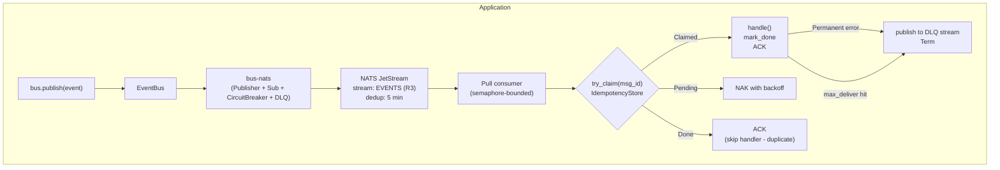

<div align="center">

# eventbus-rs

**A typed async event bus for Rust — NATS JetStream with idempotent inbox, DLQ, and circuit breaker.**

[](https://github.com/1hoodlabs/eventbus-rs/actions)
[](https://crates.io/crates/event-bus)
[](https://docs.rs/event-bus)
[](https://blog.rust-lang.org/)
[](#license)

[Docs](https://docs.rs/event-bus) · [Examples](examples/) · [Architecture](#architecture) · [Roadmap](#roadmap)

</div>

---

`eventbus-rs` is a typed, async event bus for Rust services that need **effectively-once** delivery on top of NATS JetStream. It bundles the three primitives every reliable event-driven system needs and lets you swap any of them out:

- **Typed events** with compile-time subject templates (`#[derive(Event)]`).
- **Idempotent inbox** — handlers run exactly once per `MessageId`, even on JetStream redelivery.
- **DLQ + circuit breaker + SQLite fallback** — terminal failures are isolated, transient outages don't drop messages.

The core (`bus-core`) is trait-only with **zero transport dependencies**, so you can ship a different transport later without touching application code. The transactional outbox pattern (atomic publish-with-DB-write) is **out of scope** — see [§4 Transactional publishing](#4-transactional-publishing) for guidance.

---

## Table of contents

- [Features](#features)
- [Installation](#installation)
- [Quick start](#quick-start)
- [Production usage](#production-usage)
  - [1. Connect with cluster URLs and credentials](#1-connect-with-cluster-urls-and-credentials)
  - [2. Configure JetStream for durability](#2-configure-jetstream-for-durability)
  - [3. Pick an idempotency backend](#3-pick-an-idempotency-backend)
  - [4. Transactional publishing](#4-transactional-publishing)
  - [5. Subscribe with retry, DLQ, and concurrency](#5-subscribe-with-retry-dlq-and-concurrency)
  - [6. Handle errors: Transient vs Permanent](#6-handle-errors-transient-vs-permanent)
  - [7. Graceful shutdown](#7-graceful-shutdown)
  - [8. Observability](#8-observability)
- [Cargo features](#cargo-features)
- [Architecture](#architecture)
- [Implementation status](#implementation-status)
- [Examples](#examples)
- [FAQ](#faq)
- [Roadmap](#roadmap)
- [Contributing](#contributing)
- [Security](#security)
- [License](#license)

---

## Features

- **Typed events.** `#[derive(Event)]` validates subject templates at compile time and interpolates `{self.field}` into routing keys.
- **Effectively-once delivery.** JetStream `Nats-Msg-Id` deduplication on the publish side + `IdempotencyStore` claim on the consume side.
- **Pluggable idempotency.** NATS KV (default) or Redis — both behind a single `IdempotencyStore` trait.
- **Per-consumer DLQ.** Permanent and exhausted-retry failures go to a per-consumer dead-letter stream with full failure metadata in headers.
- **Circuit breaker + SQLite fallback.** When NATS is unavailable, publishes spool to disk and replay on recovery.
- **Built for tokio.** Async-first, `Send + Sync` traits, `Arc`-cheap clones.
- **Observable.** OpenTelemetry spans + metrics for publish / consume / handle / dispatch (planned in `bus-telemetry`).
- **Permissively licensed.** MIT OR Apache-2.0, dual-licensed like the Rust ecosystem.

---

## Installation

> **Status:** crates are not yet published on crates.io. Use git or path dependencies until v0.1 is tagged. Track [#1](https://github.com/1hoodlabs/eventbus-rs/issues) for the publish ETA.

```toml
[dependencies]
event-bus = { git = "https://github.com/1hoodlabs/eventbus-rs", tag = "v0.1.0", features = [
    "macros",
    "nats-kv-inbox",
] }

# Required peer deps for application code
serde      = { version = "1", features = ["derive"] }
tokio      = { version = "1", features = ["full"] }
uuid       = { version = "1", features = ["v7", "serde"] }
async-trait = "0.1"
```

**Minimum supported Rust version (MSRV):** `1.85.0` (the workspace uses **edition 2024**).

**Runtime requirements:**

- NATS Server **2.10+** with JetStream enabled
- Redis **7+** (only if you use the `redis-inbox` feature)

A `docker-compose.yml` is included at the repo root to spin up all three locally.

---

## Quick start

The shortest path to publishing and consuming a typed event:

```rust
use async_trait::async_trait;
use event_bus::{prelude::*, EventBusBuilder};
use bus_nats::{NatsClient, NatsKvIdempotencyStore, StreamConfig, subscriber::SubscribeOptions};
use serde::{Deserialize, Serialize};
use std::time::Duration;

#[derive(Debug, Serialize, Deserialize, Event)]
#[event(subject = "events.orders.{self.order_id}.created", aggregate = "order")]
struct OrderCreated {
    id:       MessageId,
    order_id: String,
    total:    i64,
}

struct OrderHandler;

#[async_trait]
impl EventHandler<OrderCreated> for OrderHandler {
    async fn handle(&self, ctx: HandlerCtx, evt: OrderCreated) -> Result<(), HandlerError> {
        tracing::info!(order_id = %evt.order_id, msg_id = %ctx.msg_id, "received");
        Ok(())
    }
}

#[tokio::main]
async fn main() -> Result<(), Box<dyn std::error::Error>> {
    tracing_subscriber::fmt::init();

    let url = "nats://localhost:4222";
    let stream_cfg = StreamConfig { num_replicas: 1, ..Default::default() };

    // Idempotency store backed by NATS KV (default)
    let client = NatsClient::connect(url, &stream_cfg).await?;
    let store  = NatsKvIdempotencyStore::new(
        client.jetstream().clone(),
        Duration::from_secs(3600),
    ).await?;

    let bus = EventBusBuilder::new()
        .url(url)
        .stream_config(stream_cfg)
        .idempotency(store)
        .build()
        .await?;

    // Subscribe
    let _sub = bus.subscribe(
        SubscribeOptions {
            durable:     "orders-worker".into(),
            filter:      "events.orders.>".into(),
            concurrency: 8,
            ..Default::default()
        },
        OrderHandler,
    ).await?;

    // Publish
    bus.publish(&OrderCreated {
        id:       MessageId::new(),
        order_id: "ord-001".into(),
        total:    4_999,
    }).await?;

    tokio::signal::ctrl_c().await?;
    bus.shutdown().await?;
    Ok(())
}
```

For more, see [`examples/01-basic-publish`](examples/01-basic-publish/) and [`examples/03-idempotent-handler`](examples/03-idempotent-handler/).

---

## Production usage

The defaults are tuned for a single-node dev box. The sections below walk through the changes you need for a production deployment.

### 1. Connect with cluster URLs and credentials

Pass a comma-separated URL list and use the standard NATS auth methods supported by `async-nats` (configure on `NatsClient` directly when you need credentials beyond a plain URL):

```rust
let url = "nats://nats-0:4222,nats://nats-1:4222,nats://nats-2:4222";
```

Provision NATS users with JetStream permissions limited to your stream subjects and KV bucket. A typical least-privilege user only needs:

- `pub` on `events.>` and `$JS.API.STREAM.MSG.GET.EVENTS`, `$JS.ACK.>`
- `sub` on the consumer's deliver subject
- KV access on `_INBOX.eventbus_processed.>`

### 2. Configure JetStream for durability

The default `StreamConfig` already ships **R3 replication, file storage, 5-minute dedup window, 7-day retention**. Tune via the builder:

```rust
use bus_nats::StreamConfig;
use std::time::Duration;

let stream_cfg = StreamConfig {
    name:             "EVENTS".into(),
    subjects:         vec!["events.>".into()],
    num_replicas:     3,                              // R3 = quorum on 3-node cluster
    duplicate_window: Duration::from_secs(5 * 60),    // dedup window for Nats-Msg-Id
    max_age:          Duration::from_secs(30 * 86400),// 30-day retention
};
```

**Sizing guidance:**

| Setting             | Dev / single-node | Production               |
| ------------------- | ----------------- | ------------------------ |
| `num_replicas`      | `1`               | `3` (odd, ≥ 3 for quorum)|
| `duplicate_window`  | `2 min`           | `5–15 min` (≥ p99 publish retry budget) |
| `max_age`           | `1 day`           | `7–30 days` (compliance + replay budget) |
| Storage             | File              | File on local SSD/NVMe   |

### 3. Pick an idempotency backend

The bus requires **exactly one** `IdempotencyStore`. Pick by deployment topology:

| Backend | Crate / feature | When to use |
| ------- | --------------- | ----------- |
| **NATS KV** *(default)* | `bus-nats` / `nats-kv-inbox` | Default. No extra infra; rides on the NATS cluster you already run. |
| **Redis** | `bus-nats` / `redis-inbox` | You already run Redis and want lower-latency `SET NX EX` semantics. |

```rust
// NATS KV (default)
let store = bus_nats::NatsKvIdempotencyStore::new(js.clone(), Duration::from_secs(3600)).await?;

// Redis
# #[cfg(feature = "redis-inbox")]
let store = bus_nats::RedisIdempotencyStore::new(redis_url, Duration::from_secs(3600)).await?;
```

Both implement the same `IdempotencyStore` trait and use atomic compare-and-set semantics so concurrent JetStream redeliveries cannot run a handler twice.

### 4. Transactional publishing

`bus.publish()` writes directly to NATS. If you need an event publish to reflect a database mutation atomically (so a crash between commit and publish cannot drop the event), `eventbus-rs` does **not** ship that mechanism — implement the outbox pattern in your application: write an outbox row in the same transaction as the business write, then have a separate task read pending rows and call `Publisher::publish` from `bus-core`. The traits are designed to support this without forking.

### 5. Subscribe with retry, DLQ, and concurrency

```rust
use bus_nats::{DlqConfig, DlqOptions, subscriber::SubscribeOptions};
use std::time::Duration;

let dlq = DlqConfig {
    num_replicas: 3,
    max_age:      Duration::from_secs(30 * 86400),
    ..Default::default()
};

let bus = EventBusBuilder::new()
    .url(url)
    .idempotency(store)
    .with_dlq(dlq)         // enable per-consumer DLQ
    .build()
    .await?;

let sub = bus.subscribe(
    SubscribeOptions {
        stream:      "EVENTS".into(),
        durable:     "payments-worker".into(),
        filter:      "events.payments.>".into(),
        max_deliver: 5,                                    // retries before DLQ
        ack_wait:    Duration::from_secs(30),              // visibility timeout
        backoff:     vec![                                 // per-attempt delay
            Duration::from_secs(1),
            Duration::from_secs(5),
            Duration::from_secs(30),
            Duration::from_secs(300),
        ],
        concurrency: 16,                                   // in-flight handlers per worker
        ..Default::default()
    },
    PaymentHandler,
).await?;
```

Each subscription gets its own DLQ stream named `EVENTS_DLQ_<durable>` with the original headers (`X-Original-Subject`, `X-Original-Seq`, `X-Failure-Reason`, `X-Retry-Count`, …) preserved.

### 6. Handle errors: Transient vs Permanent

The `HandlerError` discriminant controls whether JetStream retries the message:

```rust
use bus_core::error::HandlerError;

#[async_trait]
impl EventHandler<PaymentProcessed> for PaymentHandler {
    async fn handle(&self, _ctx: HandlerCtx, evt: PaymentProcessed) -> Result<(), HandlerError> {
        match charge_card(&evt).await {
            Ok(_)                       => Ok(()),
            Err(e) if e.is_temporary()  => Err(HandlerError::Transient(e.to_string())), // NAK + retry with backoff
            Err(e)                      => Err(HandlerError::Permanent(e.to_string())), // Term → DLQ immediately
        }
    }
}
```

Rule of thumb:

- **Network blips, lock contention, 5xx upstream → `Transient`.** JetStream NAKs with the configured backoff; idempotency claim is released so the next attempt re-enters the handler.
- **Bad payload, business rule violation, 4xx upstream → `Permanent`.** Goes straight to DLQ; no retry.

### 7. Graceful shutdown

```rust
tokio::signal::ctrl_c().await?;
drop(sub);              // stops the consumer loop, aborts in-flight worker tasks
bus.shutdown().await?;  // drains the NATS connection
```

Dropping a `SubscriptionHandle` aborts both the outer message loop and every spawned per-message worker, so SIGTERM cleanup is bounded by `ack_wait`.

### 8. Observability

Enable structured tracing via `tracing-subscriber`. With the `otel` feature (planned in `bus-telemetry`), the bus injects W3C `traceparent` headers on publish and extracts them on receive, so spans cross the wire. Metrics emitted:

| Metric                  | Type      | Labels                        |
| ----------------------- | --------- | ----------------------------- |
| `eventbus.publish.total`     | counter   | `subject`, `result`           |
| `eventbus.consume.total`     | counter   | `stream`, `durable`, `result` |
| `eventbus.handle.duration`   | histogram | `durable`, `event_type`       |
| `eventbus.dlq.total`         | counter   | `durable`, `reason`           |
| `eventbus.jetstream.advisory.total` | counter   | `kind`, `stream`, `consumer` |

Planned advisory observability:

- Subscribe to `$JS.EVENT.ADVISORY.>` from `bus-nats::advisory` and treat it as an observability-only feed.
- Capture important JetStream advisories first: `CONSUMER.MAX_DELIVERIES` and `CONSUMER.MSG_TERMINATED`.
- Emit structured `tracing` events with advisory subject, kind, stream, consumer, sequence, and delivery count when available.
- Record an OpenTelemetry counter such as `eventbus.jetstream.advisory.total` from the `otel` feature path.
- Keep `bus-nats` independent from `bus-telemetry`; expose advisory events through tracing or a small callback interface.
- Wire the observer through `event-bus` only when `.with_otel()` / the `otel` feature is enabled.
- Do not use advisories for DLQ or message control flow yet; subscriber-side terminal handling remains the source of truth.

---

## Cargo features

| Crate         | Feature           | Default | Description                                                            |
| ------------- | ----------------- | ------- | ---------------------------------------------------------------------- |
| `event-bus`   | `macros`          | yes     | Re-export `#[derive(Event)]` from `bus-macros`                         |
| `event-bus`   | `nats-kv-inbox`   | yes     | NATS KV-backed `IdempotencyStore`                                      |
| `event-bus`   | `redis-inbox`     | no      | Redis-backed `IdempotencyStore`                                        |
| `event-bus`   | `sqlite-buffer`   | no      | Local-disk fallback buffer for offline publishing                      |
| `event-bus`   | `otel`            | no      | OpenTelemetry spans + metrics (via `bus-telemetry`)                    |
| `bus-nats`    | `nats-kv-inbox`   | yes     | (transitively enabled by `event-bus`)                                  |
| `bus-nats`    | `redis-inbox`     | no      | (transitively enabled by `event-bus`)                                  |
| `bus-nats`    | `sqlite-buffer`   | no      | (transitively enabled by `event-bus`)                                  |

Minimal install (no Postgres, no macros):

```toml
event-bus = { git = "...", default-features = false, features = ["nats-kv-inbox"] }
```

---

## Architecture


```mermaid
flowchart TD
    subgraph application["Application"]
        publish["bus.publish(event)"]
        event_bus["EventBus"]
        bus_nats["bus-nats<br/>(Publisher + Sub + CircuitBreaker + DLQ)"]
        jetstream["NATS JetStream<br/>stream: EVENTS (R3)<br/>dedup: 5 min"]
        pull_consumer["Pull consumer<br/>(semaphore-bounded)"]
        idempotency{"try_claim(msg_id)<br/>IdempotencyStore"}
        handler["handle()<br/>mark_done<br/>ACK"]
        retry["NAK with backoff"]
        duplicate["ACK<br/>(skip handler - duplicate)"]
        dlq["publish to DLQ stream<br/>Term"]

        publish --> event_bus
        event_bus --> bus_nats
        bus_nats --> jetstream
        jetstream --> pull_consumer
        pull_consumer --> idempotency
        idempotency -->|"Claimed"| handler
        idempotency -->|"Pending"| retry
        idempotency -->|"Done"| duplicate
        handler -->|"Permanent error"| dlq
        handler -->|"max_deliver hit"| dlq
    end
```

For the current component diagrams, see [`docs/diagrams/`](docs/diagrams/).

---

## Implementation status

| Component                                | Crate                                    | Status     |
| ---------------------------------------- | ---------------------------------------- | ---------- |
| Traits, `MessageId`, `BusError`          | `bus-core`                               | ✅ Shipped |
| `#[derive(Event)]` + compile-fail tests  | `bus-macros`                             | ✅ Shipped |
| NATS JetStream `Publisher`               | `bus-nats`                               | ✅ Shipped |
| Pull consumer + retry + DLQ              | `bus-nats`                               | ✅ Shipped |
| Circuit breaker (Closed/Open/HalfOpen)   | `bus-nats`                               | ✅ Shipped |
| NATS KV idempotency store *(default)*    | `bus-nats` (`nats-kv-inbox`)             | ✅ Shipped |
| Redis idempotency store                  | `bus-nats` (`redis-inbox`)               | ✅ Shipped |
| SQLite fallback buffer                   | `bus-nats` (`sqlite-buffer`)             | ✅ Shipped |
| `EventBus` facade + builder              | `event-bus`                              | ✅ Shipped |
| OTel spans + metrics                     | `bus-telemetry`                          | 📋 Planned |
| `crates.io` publish                      | all crates                               | 📋 Planned (v0.1.0) |

---

## Examples

| Example | What it shows |
| ------- | ------------- |
| [`examples/01-basic-publish`](examples/01-basic-publish/)    | Publish + JetStream `Nats-Msg-Id` deduplication |
| [`examples/03-idempotent-handler`](examples/03-idempotent-handler/) | Subscribe with idempotent handler, prove exactly-once execution under duplicate publish |

Run any example against the local docker-compose stack:

```bash
docker compose up -d nats
cargo run -p example-01-basic-publish -- nats://localhost:4222
cargo run -p example-03-idempotent-handler -- nats://localhost:4222
```

---

## FAQ

**Q: Is this exactly-once or at-least-once?**
Effectively-once. JetStream gives at-least-once at the wire level; the publish-side `Nats-Msg-Id` window plus the consume-side `IdempotencyStore` collapse duplicates so handlers run exactly once per `MessageId`. The window is bounded by `duplicate_window` (publish) and the idempotency TTL (consume).

**Q: Why NATS JetStream and not Kafka / RabbitMQ / SQS?**
JetStream gives ordered streams, server-side dedup windows, durable consumers, and KV — all in one binary, all with a permissive license, and with a clustered deployment that fits in a few hundred MB. Kafka and RabbitMQ are great; they're just heavier than what most teams need. The `bus-core` traits do not assume NATS — a `bus-kafka` backend would be a drop-in replacement.

**Q: Can I use this without Postgres?**
Yes — `eventbus-rs` does not depend on Postgres at all. NATS-KV (default) or Redis idempotency cover all supported deployments.

**Q: Is the API stable?**
No — pre-1.0. Breaking changes are tracked in `CHANGELOG.md` and called out in release notes. Pin to a tag.

---

## Roadmap

**v0.1** *(current)* — Core traits, NATS publisher/subscriber, KV/Redis idempotency, SQLite buffer, DLQ, circuit breaker.

**v0.2** — `crates.io` publish, OTel spans + metrics.

**v0.3** — (Optional) additional transport backends (Kafka, Redis Streams) if user demand emerges.

**v1.0** — API stability commitment, semver guarantees.

Track progress under [GitHub milestones](https://github.com/1hoodlabs/eventbus-rs/milestones).

---

## Contributing

Contributions are welcome. Before opening a non-trivial PR:

1. **File an issue first** for API changes, new crates, or behavior changes.
2. Keep `bus-core` free of transport-specific dependencies.
3. Add or update tests when behavior changes — including `trybuild` snapshots under `crates/bus-macros/tests/compile_fail/` for diagnostic changes.

```bash
# Required local checks before pushing
cargo fmt --all
cargo clippy --workspace --all-features -- -D warnings
cargo test --workspace
cargo test -p bus-nats     # integration; requires Docker
cargo test -p bus-nats --features sqlite-buffer
```

---

## Security

If you discover a security issue, **do not** file a public issue. Email `tech@mey.network` with steps to reproduce and impact. We aim to acknowledge within 48 hours and ship a fix or mitigation within 7 days for high-severity reports.

---

## License

Licensed under either of

- Apache License, Version 2.0 ([`LICENSE`](LICENSE) or <https://www.apache.org/licenses/LICENSE-2.0>)
- MIT license ([`LICENSE-MIT`](LICENSE-MIT) — *to be added* — or <https://opensource.org/licenses/MIT>)

at your option.

Unless you explicitly state otherwise, any contribution intentionally submitted for inclusion in this work, as defined in the Apache-2.0 license, shall be dual-licensed as above, without any additional terms or conditions.
