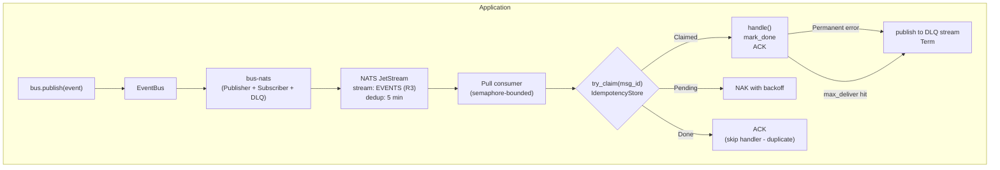

# eventbus-rs

**A typed async event bus for Rust — NATS JetStream with idempotent inbox + DLQ.**

[CI](https://github.com/1hoodlabs/eventbus-rs/actions)
[Crates.io](https://crates.io/crates/eventbus-nats)
[Docs.rs](https://docs.rs/eventbus-nats)
[MSRV](https://blog.rust-lang.org/)
[License: MIT OR Apache-2.0](#license)

[Docs](https://docs.rs/eventbus-nats) · [Examples](examples/) · [Architecture](#architecture) · [Roadmap](#roadmap)


---

`eventbus-rs` is a typed, async event bus for Rust services that need **effectively-once** delivery on top of NATS JetStream. It bundles the three primitives every reliable event-driven system needs and lets you swap any of them out:

- **Typed events** with compile-time subject templates (`#[derive(Event)]`).
- **Idempotent inbox** — handlers run exactly once per `MessageId`, even on JetStream redelivery.
- **DLQ + idempotent inbox** — terminal failures are isolated; redeliveries collapse to one handler run per `MessageId`.

The core (`bus-core`) is trait-only with **zero transport dependencies**, so you can ship a different transport later without touching application code. The transactional outbox pattern (atomic publish-with-DB-write) is **out of scope** — see [§4 Transactional publishing](#4-transactional-publishing) for guidance.

---

## Table of contents

- [Features](#features)
- [Installation](#installation)
- [Quick start](#quick-start)
- [Production usage](#production-usage)
  - [1. Connect with cluster URLs and credentials](#1-connect-with-cluster-urls-and-credentials)
  - [2. Configure JetStream for durability](#2-configure-jetstream-for-durability)
  - [3. Pick an idempotency backend](#3-pick-an-idempotency-backend)
  - [4. Transactional publishing](#4-transactional-publishing)
  - [5. Subscribe with retry, DLQ, and concurrency](#5-subscribe-with-retry-dlq-and-concurrency)
  - [6. Handle errors: Transient vs Permanent](#6-handle-errors-transient-vs-permanent)
  - [7. Graceful shutdown](#7-graceful-shutdown)
  - [8. Observability](#8-observability)
- [Cargo features](#cargo-features)
- [Architecture](#architecture)
- [Implementation status](#implementation-status)
- [Examples](#examples)
- [FAQ](#faq)
- [Roadmap](#roadmap)
- [Contributing](#contributing)
- [Security](#security)
- [License](#license)

---

## Features

- **Typed events.** `#[derive(Event)]` validates subject templates at compile time and interpolates `{self.field}` into routing keys.
- **Effectively-once delivery.** JetStream `Nats-Msg-Id` deduplication on the publish side + `IdempotencyStore` claim on the consume side.
- **Pluggable idempotency.** NATS KV (default) or Redis — both behind a single `IdempotencyStore` trait.
- **Per-consumer DLQ.** Permanent and exhausted-retry failures go to a per-consumer dead-letter stream with full failure metadata in headers.
- **Built for tokio.** Async-first, `Send + Sync` traits, `Arc`-cheap clones.
- **Permissively licensed.** MIT OR Apache-2.0, dual-licensed like the Rust ecosystem.

---

## Installation

### Prerequisites

- **Rust toolchain** supporting **Edition 2024**. The workspace declares **MSRV `1.85.0`** — use that or newer.
- **NATS Server 2.10+** with **JetStream** enabled (`-js`) when your app runs.
- **Redis 7+** only if you enable the **`redis-inbox`** feature on `eventbus-nats` / `bus-nats`.

### Add dependencies (`crates.io`)

Published packages: **`bus-core`**, **`bus-nats`**, **`eventbus-macros`**, **`eventbus-nats`**. Pin an exact version until 1.0.

**Typical app** — typed events with `#[derive(Event)]`, NATS KV idempotency, `EventBus` facade. Two crates is the minimum here because the proc-macro emits `bus_core::…` paths and `serde`-style requires `bus-core` to be a peer dependency:

```toml
[dependencies]
eventbus-nats = { version = "0.1.2", features = ["macros", "nats-kv-inbox"] }
bus-core      = "0.1.1"

serde       = { version = "1", features = ["derive"] }
tokio       = { version = "1", features = ["full"] }
uuid        = { version = "1", features = ["v7", "serde"] }
async-trait = "0.1"
```

You do **not** need to add `bus-nats` to your `Cargo.toml`. `eventbus-nats` re-exports the transport surface you commonly need:

- Top-level: `NatsClient`, `StreamConfig`, `SubscribeOptions`, `ConnectOptions`, `NatsPublisher`, `NatsKvIdempotencyConfig`.
- Namespace: anything else under `eventbus_nats::nats::…` (e.g. `nats::advisory::*`, `nats::dlq::*`).
- `eventbus_nats::core::*` exposes `bus_core::*` if you want the trait crate without declaring it.

**Without `derive(Event)`** — implement the `Event` trait by hand and you can drop `bus-core` from `Cargo.toml`:

```toml
eventbus-nats = { version = "0.1.2", default-features = false, features = ["nats-kv-inbox"] }
```

```rust
use eventbus_nats::core::{Event, MessageId};
use std::borrow::Cow;

#[derive(serde::Serialize, serde::Deserialize)]
struct OrderCreated { id: MessageId, order_id: String }

impl Event for OrderCreated {
    fn subject(&self) -> Cow<'_, str> { Cow::Owned(format!("events.orders.{}.created", self.order_id)) }
    fn message_id(&self) -> MessageId { self.id.clone() }
}
```

**Redis-backed idempotency** (still uses NATS JetStream for messaging):

```toml
eventbus-nats = { version = "0.1.2", features = ["macros", "nats-kv-inbox", "redis-inbox"] }
bus-core      = "0.1.1"
```

**Bypass the facade** (no `eventbus-nats`, build your own wiring):

```toml
bus-core = "0.1.1"
bus-nats = { version = "0.1.1", features = ["nats-kv-inbox"] }
```

### Crate name → Rust identifier

Hyphens in a Cargo crate name become underscores in Rust imports:

| In `Cargo.toml`     | In `use …`        |
| ------------------- | ----------------- |
| `eventbus-nats`     | `eventbus_nats`   |
| `bus-nats`          | `bus_nats`        |
| `eventbus-macros`   | `eventbus_macros` |
| `bus-core`          | `bus_core`        |

### Local NATS (quick)

From a checkout of this repo:

```bash
docker compose up -d nats
```

Or any JetStream-capable NATS reachable at your URL (examples use `nats://localhost:4222`).

### From Git instead of crates.io

Pin a tag or revision so builds stay reproducible:

```toml
[dependencies]
eventbus-nats = { git = "https://github.com/scriptkid23/eventbus-rs", tag = "v0.1.2", package = "eventbus-nats", features = ["macros", "nats-kv-inbox"] }
bus-core      = { git = "https://github.com/scriptkid23/eventbus-rs", tag = "v0.1.2", package = "bus-core" }
serde         = { version = "1", features = ["derive"] }
tokio         = { version = "1", features = ["full"] }
uuid          = { version = "1", features = ["v7", "serde"] }
async-trait   = "0.1"
```

The extra `package = "…"` keys are needed because this repository is a **Cargo workspace** (not a single-crate repo root).

---

## Quick start

The shortest path to publishing and consuming a typed event:

```rust
use async_trait::async_trait;
use eventbus_nats::{
    EventBusBuilder, NatsClient, NatsKvIdempotencyConfig, StreamConfig, SubscribeOptions,
    nats::advisory::{AdvisoryLogOptions, spawn_jetstream_advisory_logger},
    prelude::*,
};
use serde::{Deserialize, Serialize};
use std::time::Duration;

#[derive(Debug, Serialize, Deserialize, Event)]
#[event(subject = "events.orders.{self.order_id}.created", aggregate = "order")]
struct OrderCreated {
    id:       MessageId,
    order_id: String,
    total:    i64,
}

struct OrderHandler;

#[async_trait]
impl EventHandler<OrderCreated> for OrderHandler {
    async fn handle(&self, ctx: HandlerCtx, evt: OrderCreated) -> Result<(), HandlerError> {
        tracing::info!(order_id = %evt.order_id, msg_id = %ctx.msg_id, "received");
        Ok(())
    }
}

#[tokio::main]
async fn main() -> Result<(), Box<dyn std::error::Error>> {
    tracing_subscriber::fmt::init();

    let url = "nats://localhost:4222";
    let stream_cfg = StreamConfig { num_replicas: 1, ..Default::default() };

    // Idempotency store backed by NATS KV (default)
    let client = NatsClient::connect(url, &stream_cfg).await?;
    let _advisory_logger = spawn_jetstream_advisory_logger(
        client.jetstream(),
        AdvisoryLogOptions::default(),
    ).await?;
    let store  = NatsKvIdempotencyStore::new(
        client.jetstream().clone(),
        NatsKvIdempotencyConfig {
            num_replicas: 1,
            max_age: Duration::from_secs(3600),
            ..Default::default()
        },
    ).await?;

    let bus = EventBusBuilder::new()
        .url(url)
        .stream_config(stream_cfg)
        .idempotency(store)
        .build()
        .await?;

    // Subscribe
    let _sub = bus.subscribe(
        SubscribeOptions {
            durable:     "orders-worker".into(),
            filter:      "events.orders.>".into(),
            concurrency: 8,
            ..Default::default()
        },
        OrderHandler,
    ).await?;

    // Publish
    bus.publish(&OrderCreated {
        id:       MessageId::new(),
        order_id: "ord-001".into(),
        total:    4_999,
    }).await?;

    tokio::signal::ctrl_c().await?;
    bus.shutdown().await?;
    Ok(())
}
```

For more, see `[examples/01-basic-publish](examples/01-basic-publish/)` and `[examples/03-idempotent-handler](examples/03-idempotent-handler/)`.

---

## Production usage

The defaults are tuned for a single-node dev box. The sections below walk through the changes you need for a production deployment.

### 1. Connect with cluster URLs and credentials

`async_nats::ConnectOptions` is the source of truth for auth, TLS, and tuning;
`bus-nats` re-exports it as `ConnectOptions` so you don't add `async-nats` to your own `Cargo.toml`.

```rust
use bus_nats::{ConnectOptions, NatsClient, StreamConfig};
use std::time::Duration;

// 1) Credentials file (NATS user JWT)
let opts = ConnectOptions::with_credentials_file("/etc/nats/app.creds").await?;
let client = NatsClient::connect_with_options(
    "nats://nats-0:4222,nats://nats-1:4222,nats://nats-2:4222",
    opts,
    &StreamConfig::default(),
).await?;

// 2) User/password + TLS + tuning
let opts = ConnectOptions::with_user_and_password("svc-orders".into(), pass)
    .require_tls(true)
    .max_reconnects(Some(60))
    .ping_interval(Duration::from_secs(20))
    .name("orders-worker".into());
let client = NatsClient::connect_with_options(url, opts, &stream_cfg).await?;

// 3) NKey (seed)
let opts = ConnectOptions::with_nkey(seed.into());
```

A comma-separated URL string is parsed as multiple servers — no extra parsing needed.

A typical least-privilege NATS user only needs:

- `pub` on `events.>` and `$JS.API.STREAM.MSG.GET.EVENTS`, `$JS.ACK.>`
- `sub` on the consumer's deliver subject
- KV access on `$KV.eventbus_processed.>`
- `pub` on `dlq.>` and `$JS.API.STREAM.CREATE.*` (auto-create DLQ on subscribe; stream names like `DLQ_EVENTS_worker` are one token, so `*` is sufficient unless you need broader API rights)

### 2. Configure JetStream for durability

The default `StreamConfig` already ships **R3 replication, file storage, 5-minute dedup window, 7-day retention**. Tune via the builder:

```rust
use bus_nats::StreamConfig;
use std::time::Duration;

let stream_cfg = StreamConfig {
    name:             "EVENTS".into(),
    subjects:         vec!["events.>".into()],
    num_replicas:     3,                              // R3 = quorum on 3-node cluster
    duplicate_window: Duration::from_secs(5 * 60),    // dedup window for Nats-Msg-Id
    max_age:          Duration::from_secs(30 * 86400),// 30-day retention
};
```

**Sizing guidance:**


| Setting            | Dev / single-node | Production                               |
| ------------------ | ----------------- | ---------------------------------------- |
| `num_replicas`     | `1`               | `3` (odd, ≥ 3 for quorum)                |
| `duplicate_window` | `2 min`           | `5–15 min` (≥ p99 publish retry budget)  |
| `max_age`          | `1 day`           | `7–30 days` (compliance + replay budget) |
| `NatsKvIdempotencyConfig.num_replicas` | `1`               | `3` (match stream replicas)              |
| Storage            | File              | File on local SSD/NVMe                   |


### 3. Pick an idempotency backend

The bus requires **exactly one** `IdempotencyStore`. Pick by deployment topology:


| Backend                 | Crate / feature              | When to use                                                         |
| ----------------------- | ---------------------------- | ------------------------------------------------------------------- |
| **NATS KV** *(default)* | `bus-nats` / `nats-kv-inbox` | Default. No extra infra; rides on the NATS cluster you already run. |
| **Redis**               | `bus-nats` / `redis-inbox`   | You already run Redis and want lower-latency `SET NX EX` semantics. |


```rust
// NATS KV (default)
let store = bus_nats::NatsKvIdempotencyStore::new(
    js.clone(),
    bus_nats::NatsKvIdempotencyConfig {
        num_replicas: 3,
        max_age: Duration::from_secs(7 * 24 * 3600),
        ..Default::default()
    },
).await?;

// Redis
# #[cfg(feature = "redis-inbox")]
let store = bus_nats::RedisIdempotencyStore::connect(bus_nats::RedisIdempotencyConfig {
    url: redis_url.into(),
    ..Default::default()
}).await?;
```

Both implement the same `IdempotencyStore` trait and use atomic compare-and-set semantics so concurrent JetStream redeliveries cannot run a handler twice.

### 4. Transactional publishing

`bus.publish()` writes directly to NATS. If you need an event publish to reflect a database mutation atomically (so a crash between commit and publish cannot drop the event), `eventbus-rs` does **not** ship that mechanism — implement the outbox pattern in your application: write an outbox row in the same transaction as the business write, then have a separate task read pending rows and call `Publisher::publish` from `bus-core`. The traits are designed to support this without forking.

### 5. Subscribe with retry, DLQ, and concurrency

```rust
use bus_nats::{DlqConfig, DlqOptions, subscriber::SubscribeOptions};
use std::time::Duration;

let dlq = DlqConfig {
    num_replicas: 3,
    max_age:      Duration::from_secs(30 * 86400),
    ..Default::default()
};

let bus = EventBusBuilder::new()
    .url(url)
    .idempotency(store)
    .with_dlq(dlq)         // enable per-consumer DLQ
    .build()
    .await?;

let sub = bus.subscribe(
    SubscribeOptions {
        stream:      "EVENTS".into(),
        durable:     "payments-worker".into(),
        filter:      "events.payments.>".into(),
        max_deliver: 5,                                    // retries before DLQ
        ack_wait:    Duration::from_secs(30),              // visibility timeout
        backoff:     vec![                                 // per-attempt delay
            Duration::from_secs(1),
            Duration::from_secs(5),
            Duration::from_secs(30),
            Duration::from_secs(300),
        ],
        concurrency: 16,                                   // in-flight handlers per worker
        ..Default::default()
    },
    PaymentHandler,
).await?;
```

Each subscription gets its own DLQ stream named `DLQ_<source-stream>_<durable>` (e.g. `DLQ_EVENTS_payments-worker`). It is created automatically the first time you call `subscribe()` with `DlqOptions` set (idempotent if you pre-provision the stream). Original headers (`X-Original-Subject`, `X-Original-Seq`, `X-Failure-Reason`, `X-Retry-Count`, …) are preserved.

### 6. Handle errors: Transient vs Permanent

The `HandlerError` discriminant controls whether JetStream retries the message:

```rust
use bus_core::error::HandlerError;

#[async_trait]
impl EventHandler<PaymentProcessed> for PaymentHandler {
    async fn handle(&self, _ctx: HandlerCtx, evt: PaymentProcessed) -> Result<(), HandlerError> {
        match charge_card(&evt).await {
            Ok(_)                       => Ok(()),
            Err(e) if e.is_temporary()  => Err(HandlerError::Transient(e.to_string())), // NAK + retry with backoff
            Err(e)                      => Err(HandlerError::Permanent(e.to_string())), // Term → DLQ immediately
        }
    }
}
```

Rule of thumb:

- **Network blips, lock contention, 5xx upstream → `Transient`.** JetStream NAKs with the configured backoff; idempotency claim is released so the next attempt re-enters the handler.
- **Bad payload, business rule violation, 4xx upstream → `Permanent`.** Goes straight to DLQ; no retry.

### 7. Graceful shutdown

```rust
tokio::signal::ctrl_c().await?;
drop(sub);              // stops the consumer loop, aborts in-flight worker tasks
bus.shutdown().await?;  // drains the NATS connection
```

Dropping a `SubscriptionHandle` aborts both the outer message loop and every spawned per-message worker, so SIGTERM cleanup is bounded by `ack_wait`.

### 8. Observability

`bus-nats` emits structured `tracing` events at `info` / `warn` / `error` for publish, consume, retry, idempotency-store outcomes, and DLQ handoff. Wire your preferred `tracing-subscriber` layer (JSON, OTLP, …) in your application bootstrap to forward those to whatever observability stack you run. `eventbus-rs` itself does not bundle a metrics exporter or define its own metrics.

---

## Cargo features


| Crate       | Feature         | Default | Description                                       |
| ----------- | --------------- | ------- | ------------------------------------------------- |
| `eventbus-nats` | `macros`        | yes     | Re-export `#[derive(Event)]` from `eventbus-macros` |
| `eventbus-nats` | `nats-kv-inbox` | yes     | NATS KV-backed `IdempotencyStore`                 |
| `eventbus-nats` | `redis-inbox`   | no      | Redis-backed `IdempotencyStore`                   |
| `bus-nats`      | `nats-kv-inbox` | yes     | (transitively enabled by `eventbus-nats`)         |
| `bus-nats`      | `redis-inbox`   | no      | (transitively enabled by `eventbus-nats`)         |


Minimal install (no Postgres, no macros):

```toml
eventbus-nats = { version = "0.1.1", default-features = false, features = ["nats-kv-inbox"] }
```

---

## Architecture


```mermaid
flowchart TD
    subgraph application["Application"]
        publish["bus.publish(event)"]
        facade["EventBus"]
        bus_nats["bus-nats<br/>(Publisher + Subscriber + DLQ)"]
        jetstream["NATS JetStream<br/>stream: EVENTS (R3)<br/>dedup: 5 min"]
        pull_consumer["Pull consumer<br/>(semaphore-bounded)"]
        idempotency{"try_claim(msg_id)<br/>IdempotencyStore"}
        handler["handle()<br/>mark_done<br/>ACK"]
        retry["NAK with backoff"]
        duplicate["ACK<br/>(skip handler - duplicate)"]
        dlq["publish to DLQ stream<br/>Term"]

        publish --> facade
        facade --> bus_nats
        bus_nats --> jetstream
        jetstream --> pull_consumer
        pull_consumer --> idempotency
        idempotency -->|"Claimed"| handler
        idempotency -->|"Pending"| retry
        idempotency -->|"Done"| duplicate
        handler -->|"Permanent error"| dlq
        handler -->|"max_deliver hit"| dlq
    end
```


For the current component diagrams, see `[docs/diagrams/](docs/diagrams/)`.

---

## Implementation status


| Component                               | Crate                        | Status              |
| --------------------------------------- | ---------------------------- | ------------------- |
| Traits, `MessageId`, `BusError`         | `bus-core`                   | ✅ Shipped           |
| `#[derive(Event)]` + compile-fail tests | `eventbus-macros`            | ✅ Shipped           |
| NATS JetStream `Publisher`              | `bus-nats`                   | ✅ Shipped           |
| Pull consumer + retry + DLQ             | `bus-nats`                   | ✅ Shipped           |
| NATS KV idempotency store *(default)*   | `bus-nats` (`nats-kv-inbox`) | ✅ Shipped           |
| Redis idempotency store                 | `bus-nats` (`redis-inbox`)   | ✅ Shipped           |
| `EventBus` facade + builder             | `eventbus-nats`              | ✅ Shipped           |
| `crates.io` packages                    | `bus-core`, `bus-nats`, `eventbus-macros`, `eventbus-nats` (`v0.1.1`) | ✅ Published         |


---

## Examples


| Example                                                             | What it shows                                                                           |
| ------------------------------------------------------------------- | --------------------------------------------------------------------------------------- |
| `[examples/01-basic-publish](examples/01-basic-publish/)`           | Publish + JetStream `Nats-Msg-Id` deduplication                                         |
| `[examples/03-idempotent-handler](examples/03-idempotent-handler/)` | Subscribe with idempotent handler, prove exactly-once execution under duplicate publish |


Run any example against the local docker-compose stack:

```bash
docker compose up -d nats
cargo run -p example-01-basic-publish -- nats://localhost:4222
cargo run -p example-03-idempotent-handler -- nats://localhost:4222
```

---

## FAQ

**Q: Is this exactly-once or at-least-once?**
Effectively-once. JetStream gives at-least-once at the wire level; the publish-side `Nats-Msg-Id` window plus the consume-side `IdempotencyStore` collapse duplicates so handlers run exactly once per `MessageId`. The window is bounded by `duplicate_window` (publish) and the idempotency TTL (consume).

**Q: Why NATS JetStream and not Kafka / RabbitMQ / SQS?**
JetStream gives ordered streams, server-side dedup windows, durable consumers, and KV — all in one binary, all with a permissive license, and with a clustered deployment that fits in a few hundred MB. Kafka and RabbitMQ are great; they're just heavier than what most teams need. The `bus-core` traits do not assume NATS — a `bus-kafka` backend would be a drop-in replacement.

**Q: Can I use this without Postgres?**
Yes — `eventbus-rs` does not depend on Postgres at all. NATS-KV (default) or Redis idempotency cover all supported deployments.

**Q: Is the API stable?**
No — pre-1.0. Breaking changes are tracked in `CHANGELOG.md` and called out in release notes. Pin a **semver version** (`0.1.1`) or a **Git tag** in `Cargo.toml`.

---

## Roadmap

**v0.1** *(current)* — Core traits, NATS publisher/subscriber, KV/Redis idempotency, DLQ, **crates.io publish**.

**v0.2** — Planned improvements (documentation, ergonomics — see issues/milestones).

**v0.3** — (Optional) additional transport backends (Kafka, RabbitMQ, Redis Streams) if user demand emerges.

**v1.0** — API stability commitment, semver guarantees.

Track progress under [GitHub milestones](https://github.com/scriptkid23/eventbus-rs/milestones).

---

## Contributing

Contributions are welcome. Before opening a non-trivial PR:

1. **File an issue first** for API changes, new crates, or behavior changes.
2. Keep `bus-core` free of transport-specific dependencies.
3. Add or update tests when behavior changes — including `trybuild` snapshots under `crates/bus-macros/tests/compile_fail/` for diagnostic changes.

```bash
# Required local checks before pushing
cargo fmt --all
cargo clippy --workspace --all-features -- -D warnings
cargo test --workspace
cargo test -p eventbus-macros   # derives + compile-fail snapshots
cargo test -p bus-nats          # integration; requires Docker
cargo test -p bus-nats --features redis-inbox
```

---

## Security

If you discover a security issue, **do not** file a public issue. Email `tech@mey.network` with steps to reproduce and impact. We aim to acknowledge within 48 hours and ship a fix or mitigation within 7 days for high-severity reports.

---

## License

Licensed under either of

- Apache License, Version 2.0 (`[LICENSE](LICENSE)` or [https://www.apache.org/licenses/LICENSE-2.0](https://www.apache.org/licenses/LICENSE-2.0))
- MIT license (`[LICENSE-MIT](LICENSE-MIT)` — *to be added* — or [https://opensource.org/licenses/MIT](https://opensource.org/licenses/MIT))

at your option.

Unless you explicitly state otherwise, any contribution intentionally submitted for inclusion in this work, as defined in the Apache-2.0 license, shall be dual-licensed as above, without any additional terms or conditions.