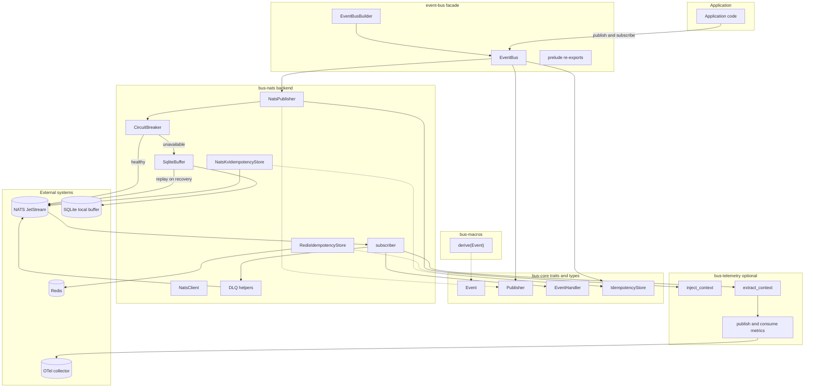

# eventbus-rs — Component Interaction Diagram

## C4 Level 3: Component Interactions (Slim Transport Scope)

## Key Flows

### Publish
`Application` -> `EventBus` -> `NatsPublisher` -> `CircuitBreaker` -> `NATS JetStream`

If NATS is unavailable: `CircuitBreaker` -> `SqliteBuffer` -> replay to JetStream on recovery.

### Consume
`NATS JetStream` -> `subscriber` -> `IdempotencyStore` -> `EventHandler` -> ACK/NAK/Term -> optional DLQ publish.
