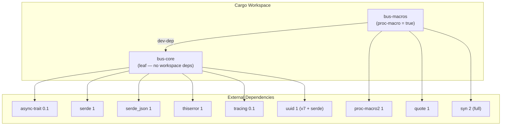
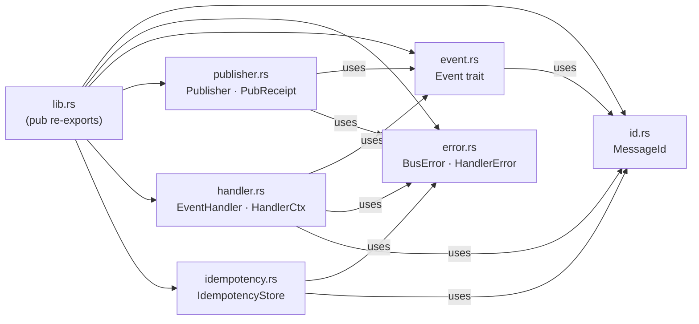
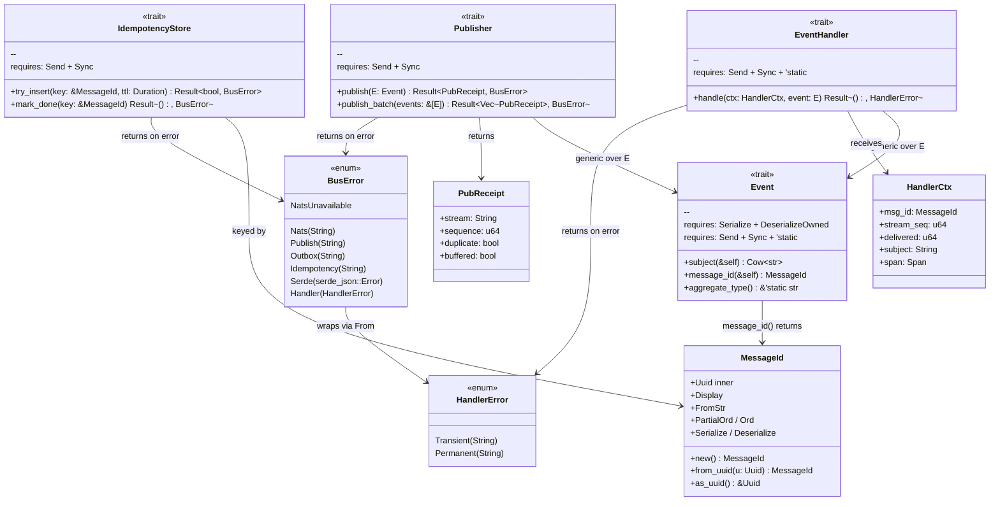
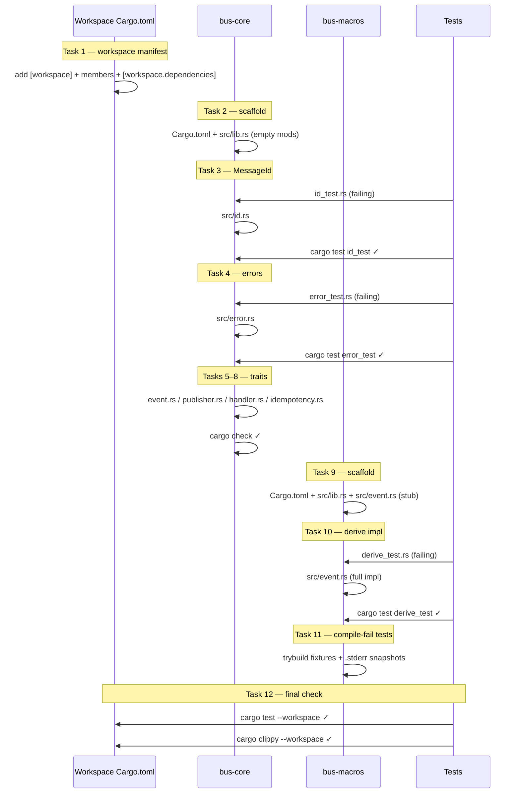
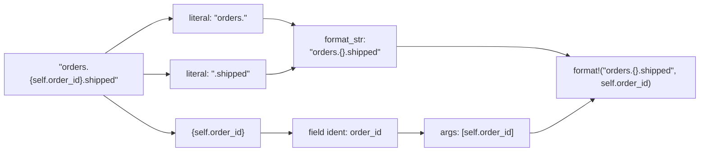

# Plan 1: bus-core + bus-macros — Diagrams

## 1. Workspace Crate Dependency Graph



---

## 2. bus-core Module Structure



---

## 3. Component Diagram — bus-core Types & Traits



---

## 4. bus-macros — #[derive(Event)] Code Generation Flow

```mermaid
flowchart TD
    A["User writes:<br/>#[derive(Event)]<br/>#[event(subject = &quot;orders.{self.order_id}.created&quot;, aggregate = &quot;order&quot;)]<br/>struct OrderCreated &#123; id: MessageId, order_id: Uuid &#125;"]

    A --> B["proc_macro_derive<br/>derive_event(input: TokenStream)"]
    B --> C["syn::parse_macro_input!<br/>→ DeriveInput AST"]
    C --> D{"Has #[event(...)]<br/>attribute?"}
    D -->|no| E["compile_error!<br/>missing #[event(subject = ...)]"]
    D -->|yes| F["parse subject = &quot;...&quot;<br/>and aggregate = &quot;...&quot;"]
    F --> G{"Has named field<br/>id: MessageId?"}
    G -->|no| H["compile_error!<br/>requires field named `id`"]
    G -->|yes| I["build_subject_expr()<br/>parse {self.field} tokens"]
    I --> J{"Any unclosed &#123;<br/>or invalid expr?"}
    J -->|yes| K["compile_error!<br/>invalid template"]
    J -->|no| L["quote! generate<br/>impl bus_core::Event for OrderCreated"]
    L --> M["subject() → format!(\"orders.{}.created\", self.order_id)"]
    L --> N["message_id() → self.id.clone()"]
    L --> O["aggregate_type() → \"order\""]
```

---

## 5. Task Execution Sequence (Plan 1)



---

## 6. Subject Template Parsing Example


