# eventbus-rs — System Diagrams

## 1. Full Workspace Crate Dependency Graph

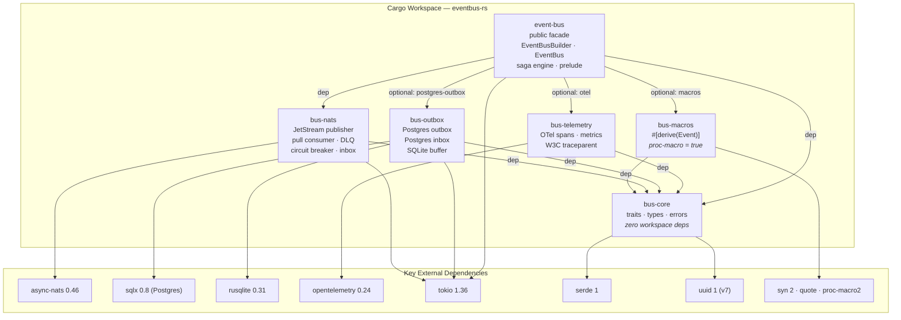

---

## 2. Feature Flag Map — `event-bus` crate

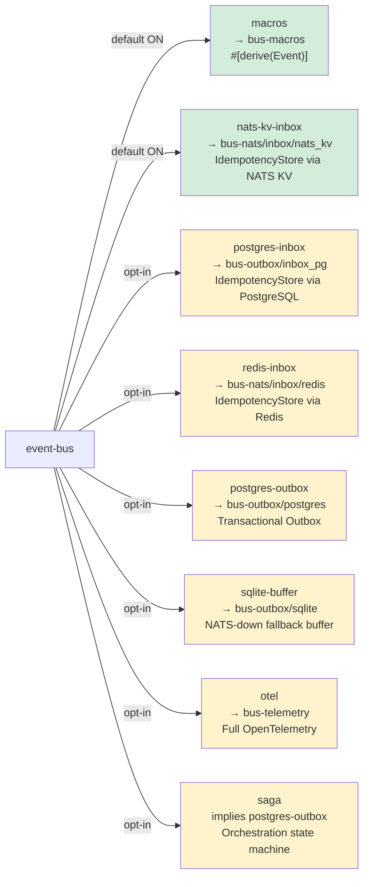

---

## 3. bus-core — Complete Type & Trait Map

```mermaid
classDiagram
    class MessageId {
        -Uuid inner
        +new() MessageId
        +from_uuid(u: Uuid) MessageId
        +as_uuid() &Uuid
        +to_string() String
        +from_str(s: &str) Result~MessageId~
        +PartialOrd / Ord / Hash
        +Serialize / Deserialize
    }

    class Event {
        <<trait>>
        +subject(&self) Cow~str~
        +message_id(&self) MessageId
        +aggregate_type() &'static str
        --
        bounds: Serialize + DeserializeOwned
        bounds: Send + Sync + 'static
    }

    class PubReceipt {
        +stream: String
        +sequence: u64
        +duplicate: bool
        +buffered: bool
    }

    class Publisher {
        <<trait>>
        +publish~E:Event~(&self, event) Result~PubReceipt~
        +publish_batch~E:Event~(&self, events) Result~Vec~PubReceipt~~
        --
        NOTE: not object-safe (generic methods)
        bounds: Send + Sync
    }

    class HandlerCtx {
        +msg_id: MessageId
        +stream_seq: u64
        +delivered: u64
        +subject: String
        +span: tracing::Span
    }

    class EventHandler {
        <<trait>>
        +handle(ctx: HandlerCtx, event: E) Result~(), HandlerError~
        --
        bounds: Send + Sync + 'static
    }

    class IdempotencyStore {
        <<trait>>
        +try_insert(key: &MessageId, ttl: Duration) Result~bool~
        +mark_done(key: &MessageId) Result~()~
        --
        MUST be atomic (INSERT ON CONFLICT,
        KV.Create, SET NX)
        bounds: Send + Sync
    }

    class BusError {
        <<enum>>
        Nats(String)
        Publish(String)
        Outbox(String)
        Idempotency(String)
        Serde(serde_json::Error)
        Handler(HandlerError)
        NatsUnavailable
    }

    class HandlerError {
        <<enum>>
        Transient(String) → NAK + retry
        Permanent(String) → Term + DLQ
    }

    Event --> MessageId : message_id() returns
    Publisher --> Event : generic over E: Event
    Publisher --> PubReceipt : returns on success
    Publisher --> BusError : returns on error
    EventHandler --> Event : generic over E: Event
    EventHandler --> HandlerCtx : receives
    EventHandler --> HandlerError : returns on failure
    IdempotencyStore --> MessageId : key type
    IdempotencyStore --> BusError : returns on error
    BusError --> HandlerError : wraps via From
```

---

## 4. bus-nats — Internal Module Structure

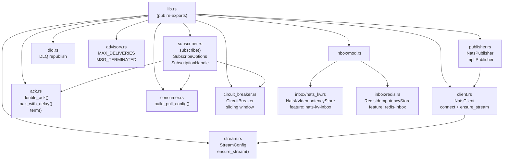

---

## 5. bus-outbox — Internal Module Structure

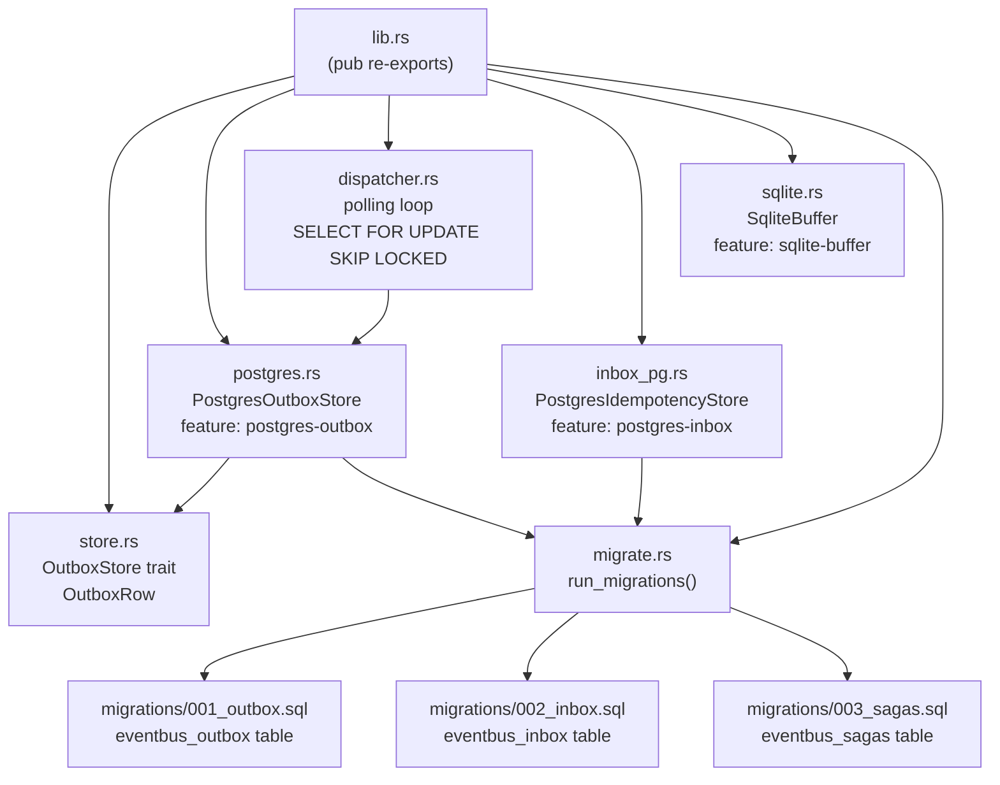

---

## 6. event-bus Facade — Internal Structure

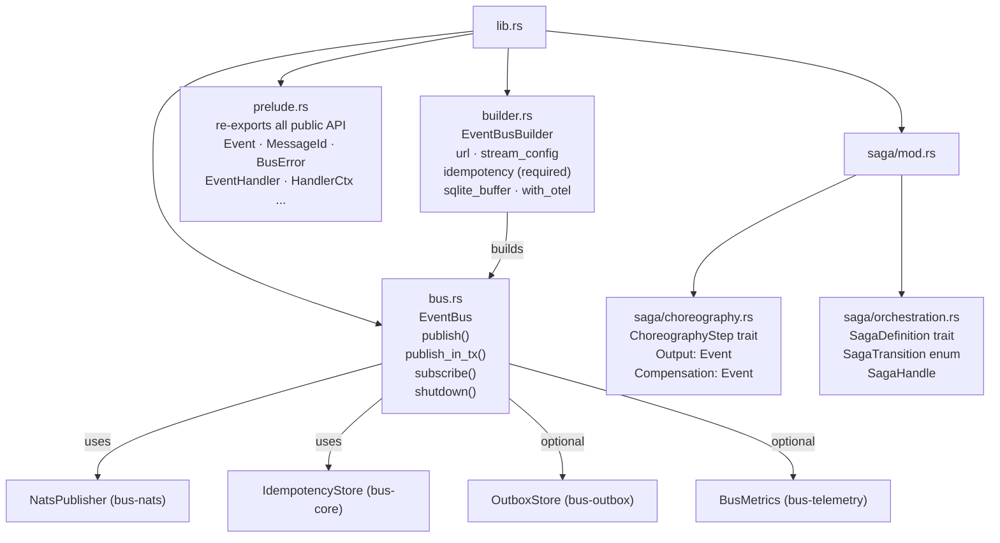

---

## 7. End-to-End Publish Flow (with Outbox)

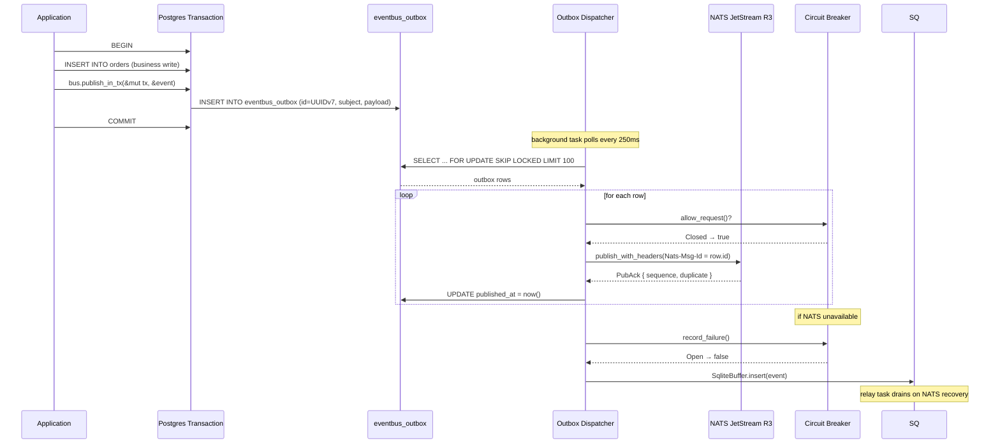

---

## 8. End-to-End Consume Flow (Pull Consumer)

```mermaid
flowchart TD
    JS["NATS JetStream<br/>pull consumer fetch"]
    JS --> MSG["Message received"]

    MSG --> EXT["Extract Nats-Msg-Id header<br/>→ MessageId<br/>(fallback: stream_seq)"]

    EXT --> IDEM{"IdempotencyStore<br/>try_insert(msg_id)"}

    IDEM -->|Ok(false) — duplicate| SKIP["double_ack → skip<br/>(already processed)"]
    IDEM -->|Err — store unavailable| NAK1["NAK(1s delay)<br/>→ redeliver"]
    IDEM -->|Ok(true) — new| DESER["serde_json::from_slice<br/>→ Event"]

    DESER -->|Err — bad payload| TERM1["AckTerm<br/>(no retry for bad data)"]
    DESER -->|Ok| HAND["handler.handle(ctx, event)"]

    HAND -->|Ok| DONE["mark_done(msg_id)<br/>→ double_ack"]
    HAND -->|Err(Transient)| NAКB["NAK(backoff delay)<br/>1s → 5s → 30s → 5m"]
    HAND -->|Err(Permanent)| TERM2["AckTerm<br/>→ republish to DLQ stream"]

    style SKIP fill:#d4edda
    style DONE fill:#d4edda
    style TERM1 fill:#f8d7da
    style TERM2 fill:#f8d7da
    style NAK1 fill:#fff3cd
    style NAКB fill:#fff3cd
```

---

## 9. Circuit Breaker State Machine

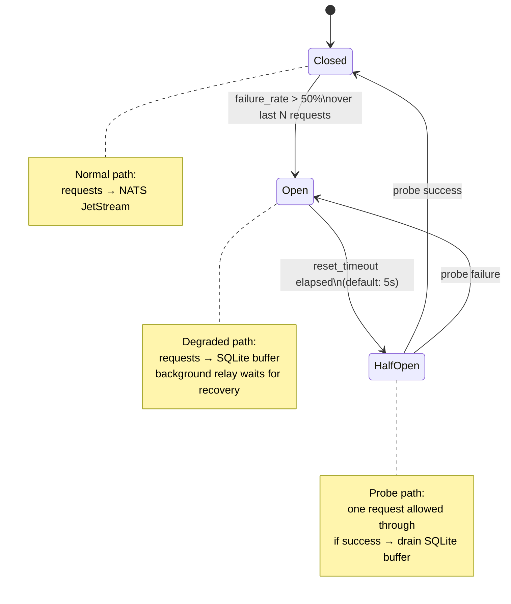

---

## 10. Idempotency Store Implementations

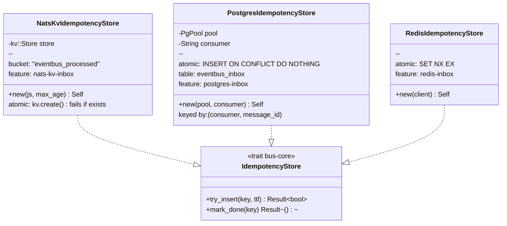

---

## 11. PostgreSQL Schema

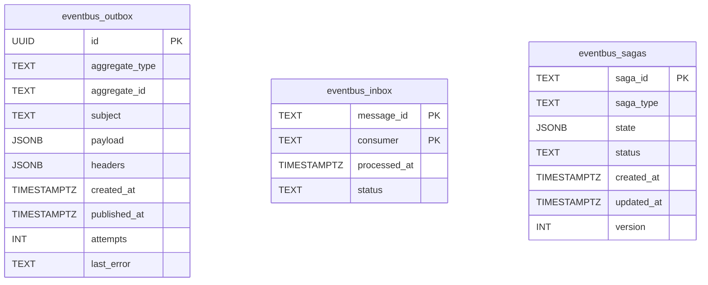

---

## 12. Saga Engine — Orchestration State Machine

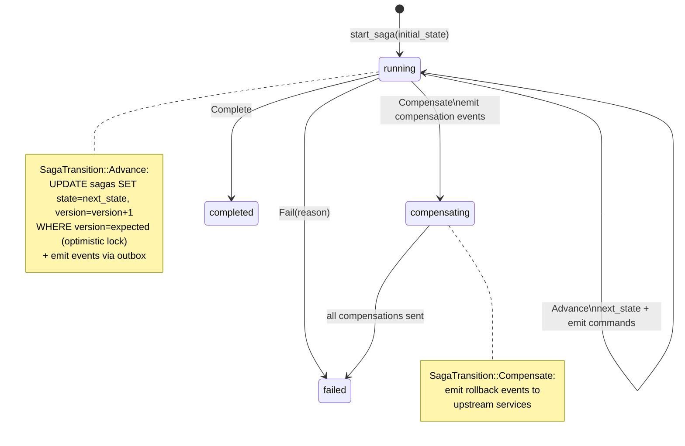

---

## 13. bus-telemetry — OTel Instrumentation Points

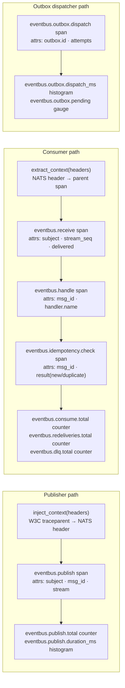

---

## 14. W3C Traceparent Cross-Service Propagation

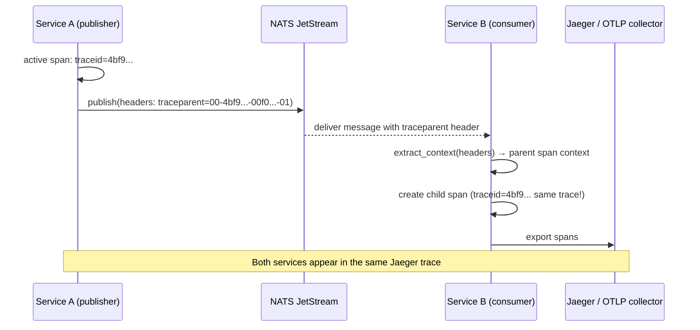

---

## 15. Implementation Plan Sequence (all 3 plans)

```mermaid
gantt
    title eventbus-rs v1.0 Implementation Roadmap
    dateFormat  X
    axisFormat  Plan %s

    section Plan 1 — bus-core + bus-macros
    Workspace Cargo.toml        :p1t1, 0, 1
    Scaffold bus-core            :p1t2, 1, 2
    MessageId (TDD)              :p1t3, 2, 3
    BusError + HandlerError (TDD):p1t4, 3, 4
    Event trait                  :p1t5, 4, 5
    Publisher + PubReceipt       :p1t6, 5, 6
    EventHandler + HandlerCtx    :p1t7, 6, 7
    IdempotencyStore             :p1t8, 7, 8
    Scaffold bus-macros          :p1t9, 8, 9
    derive(Event) impl (TDD)     :p1t10, 9, 10
    Compile-fail tests           :p1t11, 10, 11
    Full workspace check         :p1t12, 11, 12

    section Plan 2 — bus-nats + bus-outbox
    Workspace deps               :p2t1, 12, 13
    Scaffold bus-nats            :p2t2, 13, 14
    NatsClient + ensure_stream   :p2t3, 14, 15
    NatsPublisher (TDD)          :p2t4, 15, 16
    Circuit breaker (TDD)        :p2t5, 16, 17
    NatsKvIdempotencyStore (TDD) :p2t6, 17, 18
    Pull consumer loop (TDD)     :p2t7, 18, 19
    Scaffold bus-outbox          :p2t8, 19, 20
    PostgresOutboxStore (TDD)    :p2t9, 20, 21
    PostgresIdempotencyStore     :p2t10, 21, 22
    SqliteBuffer (TDD)           :p2t11, 22, 23
    Full workspace check         :p2t12, 23, 24

    section Plan 3 — bus-telemetry + event-bus
    Workspace OTel deps          :p3t1, 24, 25
    Scaffold bus-telemetry       :p3t2, 25, 26
    W3C traceparent (TDD)        :p3t3, 26, 27
    OTel spans + metrics         :p3t4, 27, 28
    Scaffold event-bus           :p3t5, 28, 29
    EventBusBuilder + EventBus   :p3t6, 29, 30
    Saga engine (TDD)            :p3t7, 30, 31
    Example 01-basic-publish     :p3t8, 31, 32
    Example 03-idempotent-handler:p3t9, 32, 33
    Final workspace check        :p3t10, 33, 34
```
