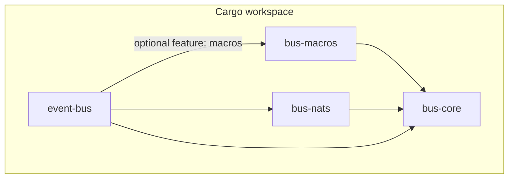
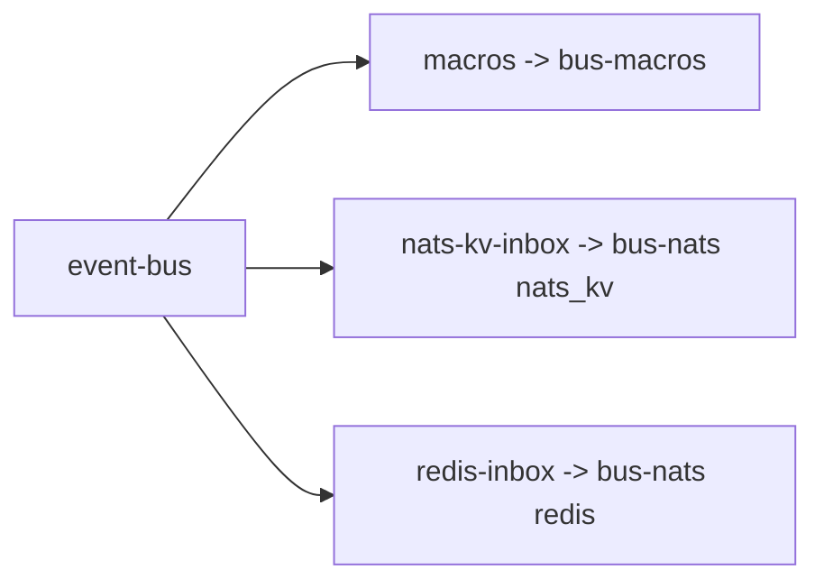
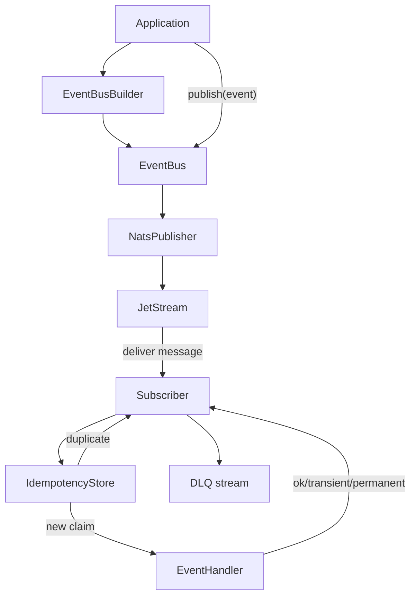

# eventbus-rs — System Diagrams (Slim Transport Scope)

## 1. Workspace Dependency Graph

```mermaid
flowchart TD
    subgraph workspace [Cargo workspace]
        busCore[bus-core]
        busMacros[bus-macros]
        busNats[bus-nats]
        eventBus[event-bus]
    end

    busMacros --> busCore
    busNats --> busCore
    eventBus --> busCore
    eventBus --> busNats
    eventBus -->|"optional feature: macros"| busMacros
```

## 2. event-bus Feature Map

```mermaid
flowchart LR
    eventBus[event-bus]
    macros["macros -> bus-macros"]
    natsKv["nats-kv-inbox -> bus-nats nats_kv"]
    redisInbox["redis-inbox -> bus-nats redis"]

    eventBus --> macros
    eventBus --> natsKv
    eventBus --> redisInbox
```

## 3. Publish and Consume Flow

```mermaid
flowchart TD
    app[Application]
    builder[EventBusBuilder]
    bus[EventBus]
    publisher[NatsPublisher]
    js[JetStream]
    sub[Subscriber]
    idem[IdempotencyStore]
    handler[EventHandler]
    dlq[DLQ stream]

    app --> builder --> bus
    app -->|"publish(event)"| bus
    bus --> publisher --> js

    js -->|"deliver message"| sub
    sub --> idem
    idem -->|"new claim"| handler
    idem -->|"duplicate"| sub
    handler -->|"ok/transient/permanent"| sub
    sub --> dlq
```
