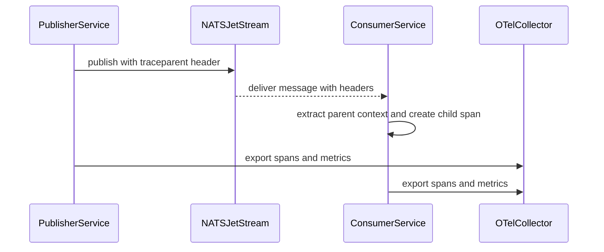

# Delete `bus-telemetry` Crate — Implementation Plan

> **For agentic workers:** REQUIRED SUB-SKILL: Use superpowers:subagent-driven-development (recommended) or superpowers:executing-plans to implement this plan task-by-task. Steps use checkbox (`- [ ]`) syntax for tracking.

**Goal:** Remove the unused `bus-telemetry` crate from the workspace and strip every README/diagram claim that depends on it, so the public surface accurately reflects what `eventbus-rs` actually ships.

**Architecture:** Pure subtraction. Touch only manifests, docs, and the deleted crate's directory; do not modify any `.rs` file in `bus-core`/`bus-macros`/`bus-nats`/`event-bus` (none of them import `bus_telemetry` today). Per-task commits prefixed `slim:` to group with the prior slim work; workspace must build green at every checkpoint.

**Tech Stack:** Rust workspace (edition 2024), `cargo`, mermaid markdown.

**Reference spec:** [`docs/superpowers/specs/2026-05-05-delete-bus-telemetry-design.md`](../specs/2026-05-05-delete-bus-telemetry-design.md).

---

## File Structure (changes)

```
crates/
├── bus-core/                          UNCHANGED
├── bus-macros/                        UNCHANGED
├── bus-nats/                          UNCHANGED
├── bus-telemetry/                     DELETED (entire crate)
└── event-bus/
    └── Cargo.toml                     MODIFIED (drop `otel` feature + `bus-telemetry` dep)
Cargo.toml                             MODIFIED (drop `crates/bus-telemetry` from workspace.members)
README.md                              MODIFIED (5 surgical edits per spec §6.1)
docs/diagrams/component-diagram.md     MODIFIED (drop telemetry subgraph + otel external + 4 edges)
docs/diagrams/system-diagrams.md       MODIFIED (drop bus-telemetry/otel from §1, §2, all of §4)
```

No `.rs` source file is touched. The OTel workspace dependencies in root `Cargo.toml` (`opentelemetry`, `opentelemetry_sdk`, `opentelemetry-semantic-conventions`, `tracing-opentelemetry`) intentionally **stay** — same precedent as the prior slim spec leaving `sqlx`/`rusqlite` in place.

---

## Task 1: Strip the `otel` feature from `event-bus`

**Goal:** Remove `event-bus`'s only edge into `bus-telemetry` so the crate becomes orphan-reachable. After this task `bus-telemetry` still exists on disk and is still a workspace member; it just has no consumer in the workspace.

**Files:**
- Modify: `crates/event-bus/Cargo.toml`

### Steps

- [ ] **Step 1: Remove the `otel` feature line**

Open `crates/event-bus/Cargo.toml`. In the `[features]` block, delete this single line:

```toml
otel          = ["dep:bus-telemetry"]
```

After the edit, the `[features]` block reads:

```toml
[features]
default       = ["macros", "nats-kv-inbox"]
macros        = ["dep:bus-macros"]
nats-kv-inbox = ["bus-nats/nats-kv-inbox"]
redis-inbox   = ["bus-nats/redis-inbox"]
sqlite-buffer = ["bus-nats/sqlite-buffer"]
```

- [ ] **Step 2: Remove the `bus-telemetry` dependency line**

Still in `crates/event-bus/Cargo.toml`. In the `[dependencies]` block, delete this single line:

```toml
bus-telemetry = { path = "../bus-telemetry", optional = true }
```

After the edit, the `[dependencies]` block reads:

```toml
[dependencies]
async-trait   = { workspace = true }
bus-core      = { path = "../bus-core" }
bus-macros    = { path = "../bus-macros", optional = true }
bus-nats      = { path = "../bus-nats" }
serde         = { workspace = true }
serde_json    = { workspace = true }
tokio         = { workspace = true }
tracing       = { workspace = true }
uuid          = { workspace = true }
```

`[dev-dependencies]` is left untouched.

- [ ] **Step 3: Verify `event-bus` builds with all surviving features**

Run:

```powershell
cargo build -p event-bus --features macros,nats-kv-inbox,redis-inbox,sqlite-buffer
```

Expected: clean build, no errors. The `otel` feature no longer exists, so it must NOT be passed.

Then run with `--all-features`, which now resolves to the same set:

```powershell
cargo build -p event-bus --all-features
```

Expected: clean build.

If either command fails citing `bus-telemetry` or `otel`, find the leftover reference in `event-bus` and remove it before proceeding.

- [ ] **Step 4: Commit**

```bash
git add crates/event-bus/Cargo.toml
git commit -m "$(cat <<'EOF'
slim: drop otel feature and bus-telemetry dep from event-bus

The bus-telemetry crate has never been wired up — enabling --features otel
only added the crate to the dep graph without producing any spans, metrics,
or header propagation. Strip the feature and the dep edge so the dependency
graph reflects what ships.

Co-Authored-By: Claude Opus 4.7 (1M context) <noreply@anthropic.com>
EOF
)"
```

---

## Task 2: Delete the `bus-telemetry` crate

**Goal:** Remove the now-orphan crate from the workspace and from disk.

**Files:**
- Modify: `Cargo.toml` (root)
- Delete: `crates/bus-telemetry/` (entire directory)

### Steps

- [ ] **Step 1: Remove the workspace member entry**

Open the root `Cargo.toml`. In `[workspace] members`, delete this single line:

```toml
    "crates/bus-telemetry",
```

After the edit, the block reads:

```toml
[workspace]
members = [
    "crates/bus-core",
    "crates/bus-macros",
    "crates/bus-nats",
    "crates/event-bus",
    "examples/01-basic-publish",
    "examples/03-idempotent-handler",
]
resolver = "2"
```

`[workspace.package]` and `[workspace.dependencies]` are untouched.

- [ ] **Step 2: Delete the crate directory**

Run:

```powershell
git rm -r crates/bus-telemetry
```

Expected output lists 5 files removed:
- `crates/bus-telemetry/Cargo.toml`
- `crates/bus-telemetry/src/lib.rs`
- `crates/bus-telemetry/src/metrics.rs`
- `crates/bus-telemetry/src/propagation.rs`
- `crates/bus-telemetry/src/spans.rs`
- `crates/bus-telemetry/tests/propagation_test.rs`

(Total: 6 files. If the count differs, inspect what else was in the directory and decide whether it belongs to this deletion or not.)

- [ ] **Step 3: Verify the workspace builds with all features**

Run:

```powershell
cargo build --workspace --all-features
```

Expected: clean build of `bus-core`, `bus-macros`, `bus-nats`, `event-bus`, `example-01-basic-publish`, `example-03-idempotent-handler`.

If the build fails citing `bus-telemetry` or `bus_telemetry`, grep the workspace for the leftover reference and remove it before proceeding.

- [ ] **Step 4: Verify unit tests still pass**

Run:

```powershell
cargo test --workspace --lib
```

Expected: all unit tests pass. The deleted `propagation_test.rs` (3 tests) is no longer collected; the rest of the test count is unchanged.

- [ ] **Step 5: Commit**

```bash
git add Cargo.toml
git commit -m "$(cat <<'EOF'
slim: delete bus-telemetry crate

The crate had no callers in the workspace and no integration into the
publish/consume code paths. Users who need OpenTelemetry can wire
tracing-opentelemetry against the existing tracing::*! events in
bus-nats themselves; bus-core traits do not need to change for that.

Co-Authored-By: Claude Opus 4.7 (1M context) <noreply@anthropic.com>
EOF
)"
```

---

## Task 3: Update README — strip OTel claims

**Goal:** Apply the 5 surgical edits from spec §6.1 plus the audit grep from §6.3, so no surviving sentence in README references OTel, the `otel` feature, `bus-telemetry`, or any of the metrics that were only going to exist via that crate.

**Files:**
- Modify: `README.md`

### Steps

- [ ] **Step 1: Remove the "Observable" feature bullet**

In `README.md`, delete this single line (currently line 63, in the Features list):

```markdown
- **Observable.** OpenTelemetry spans + metrics for publish / consume / handle / dispatch (planned in `bus-telemetry`).
```

The surrounding bullets (`Built for tokio` above, `Permissively licensed` below) stay.

- [ ] **Step 2: Remove the `otel` row from the Cargo features table**

In the Cargo features table, delete this single row (currently line 350):

```markdown
| `event-bus`   | `otel`            | no      | OpenTelemetry spans + metrics (via `bus-telemetry`)                    |
```

The other rows in the table stay.

- [ ] **Step 3: Replace §8 Observability body**

In `README.md`, find the `### 8. Observability` heading (currently line 318) and replace the entire section — heading included, up to but NOT including the `---` horizontal rule that follows it (currently line 340) — with this exact replacement:

```markdown
### 8. Observability

`bus-nats` emits structured `tracing` events at `info` / `warn` / `error` for publish, consume, retry, idempotency-store outcomes, and DLQ handoff. Wire your preferred `tracing-subscriber` layer (JSON, OTLP, …) in your application bootstrap to forward those to whatever observability stack you run. `eventbus-rs` itself does not bundle an OpenTelemetry exporter or define its own metrics.
```

The text being removed is the body that starts `Enable structured tracing via …`, includes the `| Metric | Type | Labels |` table, and includes the `Planned advisory observability:` bullet list. Everything between the heading line and the trailing `---` rule is replaced.

The `---` rule on line 340 stays as-is (it separates §8 from `## Cargo features`).

- [ ] **Step 4: Remove the OTel row from the Implementation status table**

In the Implementation status table, delete this single row (currently line 409):

```markdown
| OTel spans + metrics                     | `bus-telemetry`                          | 📋 Planned |
```

The other rows stay. After the edit the only `📋 Planned` row left is `crates.io publish`, which is genuinely planned.

- [ ] **Step 5: Update Roadmap v0.2**

In the Roadmap section, change this line (currently line 451):

```markdown
**v0.2** — `crates.io` publish, OTel spans + metrics.
```

to:

```markdown
**v0.2** — `crates.io` publish.
```

The other roadmap lines (v0.1, v0.3, v1.0) stay.

- [ ] **Step 6: Run the §6.3 audit grep**

Use the Grep tool against `README.md` for each of these patterns. Each remaining hit must be either inside a code block where the text is unrelated to the deleted crate (none expected), or a real bug to fix:

- `bus-telemetry`
- `bus_telemetry`
- `OpenTelemetry`
- `traceparent`
- `eventbus.publish.total`
- `eventbus.consume.total`
- `eventbus.handle.duration`
- `eventbus.dlq.total`
- `eventbus.jetstream.advisory.total`
- `OTel`

Also run the literal search ` otel ` (with surrounding spaces, to avoid matching unrelated tokens like `protocol`).

Expected: zero hits in `README.md` for every pattern. If any hit appears, remove that line/sentence before committing.

- [ ] **Step 7: Commit**

```bash
git add README.md
git commit -m "$(cat <<'EOF'
slim: drop OTel claims from README

- Features list: remove "Observable" bullet (only content was the OTel claim)
- Cargo features table: remove `otel` row
- §8 Observability: replace body — drop the unimplemented metrics table
  and "Planned advisory observability" bullets; ship a short honest note
  pointing at tracing-subscriber instead
- Implementation status: remove "OTel spans + metrics — Planned" row
- Roadmap v0.2: drop "OTel spans + metrics" line item

Co-Authored-By: Claude Opus 4.7 (1M context) <noreply@anthropic.com>
EOF
)"
```

---

## Task 4: Update `docs/diagrams/component-diagram.md`

**Goal:** Remove the telemetry subgraph, the `otel` collector node, and the four edges that connect them from the mermaid block, so the component picture matches the slim reality.

**Files:**
- Modify: `docs/diagrams/component-diagram.md`

### Steps

- [ ] **Step 1: Delete the `telemetry` subgraph block**

Find this block (currently lines 39-44 — note the trailing blank line) and delete the **entire 6-line span**:

```
    subgraph telemetry [bus-telemetry optional]
        inject["inject_context"]
        extract["extract_context"]
        metrics["publish and consume metrics"]
    end

```

(The blank line after `end` separates it from the next subgraph and goes too.)

- [ ] **Step 2: Delete the `otel` node from the `external` subgraph**

In the `external [External systems]` subgraph block, delete this single line (currently line 49):

```
        otel[("OTel collector")]
```

The other nodes inside `external` (`jetstream`, `redis`, `sqlite`) stay. The subgraph braces stay.

- [ ] **Step 3: Delete the four telemetry edges**

In the edge list at the bottom of the mermaid block, delete these four lines (currently lines 75-78). Delete them as one contiguous block to avoid leaving stray blank lines:

```
    natsPublisher --> inject
    subscriber --> extract
    extract --> metrics
    metrics --> otel
```

If they are immediately preceded by a blank line that was separating the telemetry edges from earlier edges, delete that blank line too.

- [ ] **Step 4: Verify the markdown is intact**

Read the file and confirm:
- Mermaid block opens with ```` ```mermaid ```` and closes with ```` ``` ```` (no orphan fences).
- No `inject`, `extract`, `metrics`, or `otel` identifier appears anywhere in the file (use Grep on the file for each).
- The `## Key Flows` prose section below the mermaid block is unchanged.

- [ ] **Step 5: Sanity-check the workspace still builds**

Markdown isn't compiled, but run:

```powershell
cargo build --workspace --all-features
```

Expected: still green. (This catches any accidental edit that broke an unrelated file.)

- [ ] **Step 6: Commit**

```bash
git add docs/diagrams/component-diagram.md
git commit -m "$(cat <<'EOF'
slim: drop telemetry subgraph from component diagram

bus-telemetry was deleted in the previous commit; remove its subgraph,
the OTel collector node, and the four edges wiring publisher/subscriber
to telemetry from the C4 component picture.

Co-Authored-By: Claude Opus 4.7 (1M context) <noreply@anthropic.com>
EOF
)"
```

---

## Task 5: Update `docs/diagrams/system-diagrams.md`

**Goal:** Remove `bus-telemetry` from the workspace dependency graph (§1), the feature map (§2), and delete the §4 "Telemetry Propagation" sequence diagram entirely.

**Files:**
- Modify: `docs/diagrams/system-diagrams.md`

### Steps

- [ ] **Step 1: Update §1 Workspace Dependency Graph**

In the §1 mermaid block, three edits:

1. Inside the `subgraph workspace` block, delete the line (currently line 11):

   ```
           busTelemetry[bus-telemetry]
   ```

2. In the edge list below the subgraph, delete the line (currently line 17):

   ```
       busTelemetry --> busCore
   ```

3. In the same edge list, delete the line (currently line 20):

   ```
       eventBus -->|"optional feature: otel"| busTelemetry
   ```

The remaining edges (`busMacros --> busCore`, `busNats --> busCore`, `eventBus --> busCore`, `eventBus --> busNats`, `eventBus -->|"optional feature: macros"| busMacros`) stay.

- [ ] **Step 2: Update §2 event-bus Feature Map**

In the §2 mermaid block, two edits:

1. Delete the node line (currently line 33):

   ```
       otel["otel -> bus-telemetry"]
   ```

2. Delete the edge line (currently line 39):

   ```
       eventBus --> otel
   ```

The remaining nodes (`macros`, `natsKv`, `redisInbox`, `sqliteBuffer`) and their edges stay.

- [ ] **Step 3: Delete §4 Telemetry Propagation entirely**

Delete the entire §4 block — the heading, the mermaid fence, and everything inside (currently lines 73-87, inclusive of the heading `## 4. Telemetry Propagation`):

```
## 4. Telemetry Propagation


```

If there is a blank line separating §3 from §4 (or §4 from EOF), delete it too so the file ends cleanly after §3 Publish and Consume Flow's closing ```` ``` ````.

No renumbering is required: there is no §5.

- [ ] **Step 4: Verify the file is intact**

Read the file and confirm:
- Three `## ` sections remain: §1, §2, §3.
- No `busTelemetry`, `bus-telemetry`, `otel`, `OTelCollector`, or `traceparent` identifier appears anywhere in the file (use Grep on the file for each).
- Each mermaid fence opens and closes correctly.

- [ ] **Step 5: Sanity-check the workspace still builds**

```powershell
cargo build --workspace --all-features
```

Expected: still green.

- [ ] **Step 6: Commit**

```bash
git add docs/diagrams/system-diagrams.md
git commit -m "$(cat <<'EOF'
slim: drop telemetry from system diagrams

§1 Workspace Dependency Graph: remove bus-telemetry node and its two edges.
§2 event-bus Feature Map: remove otel node and edge.
§4 Telemetry Propagation: deleted entirely (the sequence it described
no longer exists in code).

Co-Authored-By: Claude Opus 4.7 (1M context) <noreply@anthropic.com>
EOF
)"
```

---

## Task 6: Final workspace verification

**Goal:** Confirm the post-deletion workspace is clean: formatted, lint-free, builds with all features, tests pass, and no stale `bus_telemetry` reference survives anywhere.

### Steps

- [ ] **Step 1: Run `cargo fmt --all`**

```powershell
cargo fmt --all
```

Expected: no output (already formatted) or whitespace-only changes.

If any files were reformatted, stage and commit:

```powershell
git add -A
git diff --cached --quiet; if (-not $?) { git commit -m "slim: cargo fmt --all" }
```

- [ ] **Step 2: Run clippy with all features**

```powershell
cargo clippy --workspace --all-features -- -D warnings
```

Expected: clean (no warnings, no errors).

If clippy flags real issues introduced by the deletion (unlikely — no `.rs` was edited), fix them and commit:

```powershell
git add -A
git commit -m "slim: clippy fixes after bus-telemetry deletion"
```

- [ ] **Step 3: Build with all features**

```powershell
cargo build --workspace --all-features
```

Expected: clean build of every workspace member (no `bus-telemetry` in the graph anymore).

- [ ] **Step 4: Run unit tests**

```powershell
cargo test --workspace --lib
```

Expected: all unit tests pass.

- [ ] **Step 5: Run integration tests with all features**

```powershell
cargo test --workspace --all-features
```

Expected: all tests pass. Tests using `testcontainers` (NATS / Redis) require Docker; if Docker is not running on the dev box those tests are skipped/errored — acceptable. The previously-deleted `propagation_test.rs` (3 tests) is no longer in the test count.

- [ ] **Step 6: Cross-repo grep for stale references**

Use the Grep tool against the entire repository for these patterns:

- `bus-telemetry`
- `bus_telemetry`
- `BusMetrics`
- `inject_context`
- `extract_context`
- `outbox_dispatch_span`
- `idempotency_span`
- `SpanBuilder`

Expected hits and what to do with each:

| Path                                                                                  | Action |
|---------------------------------------------------------------------------------------|--------|
| `Cargo.lock`                                                                          | Acceptable — regenerated by next `cargo build`; not authoritative |
| `docs/superpowers/specs/2026-05-05-delete-bus-telemetry-design.md` (this spec)        | Expected — leave alone |
| `docs/superpowers/plans/2026-05-05-delete-bus-telemetry.md` (this plan)               | Expected — leave alone |
| `docs/superpowers/specs/2026-05-05-slim-eventbus-rs-to-transport-design.md`           | Expected — historical record, leave alone |
| `docs/superpowers/plans/2026-05-05-slim-eventbus-rs.md`                               | Expected — historical record, leave alone |
| Anywhere else (especially `crates/`, `examples/`, `README.md`, `docs/diagrams/`)      | **Bug** — remove the reference and amend the appropriate task's commit, or add a follow-up commit |

If `Cargo.lock` still mentions `bus-telemetry`, run `cargo build --workspace --all-features` once and commit the regenerated lockfile:

```powershell
git add Cargo.lock
git diff --cached --quiet; if (-not $?) { git commit -m "slim: regenerate Cargo.lock after bus-telemetry deletion" }
```

- [ ] **Step 7: Spot-check working tree**

```powershell
git status
```

Expected: working tree clean (or only the optional fmt / clippy / lockfile commits added by this task).

```powershell
git log --oneline -10
```

Expected: 5–7 new commits prefixed `slim:` from this PR (Task 1, Task 2, Task 3, Task 4, Task 5, plus optional fmt / clippy / lockfile commits).

- [ ] **Step 8: Report summary to user**

Summarize in 2–3 sentences:
- Crates remaining (`bus-core`, `bus-macros`, `bus-nats`, `event-bus`).
- That `cargo build --workspace --all-features`, `cargo clippy --workspace --all-features -- -D warnings`, and `cargo test --workspace` are green.
- Number of commits in this PR (5 main + 0–3 housekeeping).
