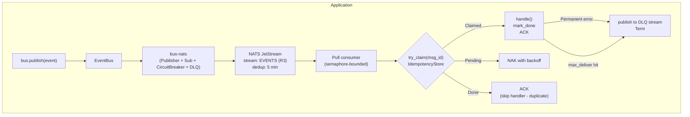

# Slim `eventbus-rs` to Event-Transport Only — Implementation Plan

> **For agentic workers:** REQUIRED SUB-SKILL: Use superpowers:subagent-driven-development (recommended) or superpowers:executing-plans to implement this plan task-by-task. Steps use checkbox (`- [ ]`) syntax for tracking.

**Goal:** Reset `eventbus-rs` workspace to a focused event-transport library (typed events + NATS + idempotent inbox + DLQ + circuit breaker + offline buffer). Delete the transactional outbox crate, Postgres idempotency, saga module, and supporting files; move the SQLite offline buffer from `bus-outbox` into `bus-nats`.

**Architecture:** Single coherent change across the workspace. Tasks are ordered so the workspace builds at every checkpoint: move SQLite buffer first (so `event-bus` can rewire its `sqlite-buffer` feature), then strip `event-bus` of outbox dependencies, then delete the orphaned crate/example/spec, then rewrite docs, then full verification.

**Tech Stack:** Rust workspace (edition 2024), `cargo`, `sqlx` (removed), `rusqlite` (relocated), `async-nats` (unchanged).

**Reference spec:** [`docs/superpowers/specs/2026-05-05-slim-eventbus-rs-to-transport-design.md`](../specs/2026-05-05-slim-eventbus-rs-to-transport-design.md).

**Note on commits:** The spec §8 step 9 mentions "single commit". This plan commits per task because (a) per-task commits make rollback easy if any verification fails and (b) align with the writing-plans skill's "frequent commits" guidance. The PR can be merged with a squash-merge if a single mainline commit is desired. All commit messages prefix with `slim:` so they group visually.

---

## File Structure (post-change)

```
crates/
├── bus-core/              UNCHANGED
├── bus-macros/            UNCHANGED
├── bus-nats/
│   ├── src/
│   │   ├── ack.rs
│   │   ├── advisory.rs
│   │   ├── circuit_breaker.rs
│   │   ├── client.rs
│   │   ├── consumer.rs
│   │   ├── dlq.rs
│   │   ├── inbox/
│   │   ├── lib.rs                    MODIFIED (+ mod sqlite_buffer)
│   │   ├── publisher.rs
│   │   ├── sqlite_buffer.rs          NEW (moved from bus-outbox/src/sqlite.rs)
│   │   ├── stream.rs
│   │   └── subscriber.rs
│   ├── tests/
│   │   └── sqlite_test.rs            NEW (moved from bus-outbox/tests/sqlite_test.rs)
│   └── Cargo.toml                    MODIFIED (+ sqlite-buffer feature, + rusqlite optional dep, + [[test]])
├── bus-telemetry/
│   └── src/metrics.rs                MODIFIED (drop outbox_dispatch_ms field)
├── bus-outbox/                       DELETED (entire crate)
└── event-bus/
    ├── Cargo.toml                    MODIFIED (drop bus-outbox + sqlx deps; drop postgres-* and saga features; remap sqlite-buffer to bus-nats)
    └── src/
        ├── lib.rs                    MODIFIED (drop pub mod saga;)
        ├── prelude.rs                MODIFIED (drop postgres re-exports; SqliteBuffer from bus_nats)
        └── saga/                     DELETED
examples/
├── 01-basic-publish/                 UNCHANGED
├── 02-outbox-postgres/               DELETED
└── 03-idempotent-handler/            UNCHANGED
docs/
├── diagrams/
│   ├── component-diagram.md          MODIFIED (drop outbox refs)
│   └── system-diagrams.md            MODIFIED (drop outbox refs)
└── superpowers/specs/
    └── 2026-05-04-outbox-dispatcher-design.md   DELETED
README.md                             REWRITTEN per spec §6
Cargo.toml                            MODIFIED (drop bus-outbox + example 02 from workspace.members)
```

---

## Task 1: Move SQLite buffer from `bus-outbox` to `bus-nats`

**Goal:** Relocate the offline-queue source + tests + feature flag from `bus-outbox` to `bus-nats` without behavior change. After this task, `bus-outbox` still compiles (still has `sqlite.rs`); the duplicate gets cleaned up in Task 5 when `bus-outbox` is deleted.

**Files:**
- Modify: `crates/bus-nats/Cargo.toml`
- Create: `crates/bus-nats/src/sqlite_buffer.rs`
- Modify: `crates/bus-nats/src/lib.rs`
- Create: `crates/bus-nats/tests/sqlite_test.rs`

### Steps

- [ ] **Step 1: Add `sqlite-buffer` feature + `rusqlite` optional dep to `bus-nats/Cargo.toml`**

Edit `crates/bus-nats/Cargo.toml`. The `[features]` block becomes:

```toml
[features]
default       = ["nats-kv-inbox"]
nats-kv-inbox = []
redis-inbox   = ["dep:redis"]
sqlite-buffer = ["dep:rusqlite"]
```

In `[dependencies]`, add the `rusqlite` line (sorted alphabetically with the others — insert after `redis`):

```toml
rusqlite    = { workspace = true, optional = true }
```

At the bottom of the file, add a new `[[test]]` entry:

```toml
[[test]]
name              = "sqlite_test"
required-features = ["sqlite-buffer"]
```

- [ ] **Step 2: Create `crates/bus-nats/src/sqlite_buffer.rs`**

Create the file with this exact content (verbatim copy of `crates/bus-outbox/src/sqlite.rs`, no behavior changes):

```rust
use rusqlite::{Connection, params};
use std::sync::{Arc, Mutex};

/// A row from the SQLite fallback buffer.
pub struct BufferRow {
    pub id:         String,
    pub subject:    String,
    pub payload:    Vec<u8>,
    pub headers:    String,
    pub created_at: i64,
    pub attempts:   i32,
}

/// Local SQLite buffer for storing events when NATS is unavailable.
/// Thread-safe via `Arc<Mutex<Connection>>`.
#[derive(Clone)]
pub struct SqliteBuffer {
    conn: Arc<Mutex<Connection>>,
}

impl SqliteBuffer {
    /// Open or create a SQLite database at `path`.
    pub fn open(path: &str) -> Result<Self, rusqlite::Error> {
        let conn = Connection::open(path)?;
        Self::init(conn)
    }

    /// Create an in-memory SQLite database (useful for tests).
    pub fn in_memory() -> Result<Self, rusqlite::Error> {
        let conn = Connection::open_in_memory()?;
        Self::init(conn)
    }

    fn init(conn: Connection) -> Result<Self, rusqlite::Error> {
        conn.execute_batch(
            "CREATE TABLE IF NOT EXISTS eventbus_buffer (
                id          TEXT    PRIMARY KEY,
                subject     TEXT    NOT NULL,
                payload     BLOB    NOT NULL,
                headers     TEXT    NOT NULL DEFAULT '{}',
                created_at  INTEGER NOT NULL,
                attempts    INTEGER NOT NULL DEFAULT 0
            );",
        )?;
        Ok(Self {
            conn: Arc::new(Mutex::new(conn)),
        })
    }

    /// Insert an event into the buffer.
    pub fn insert(
        &self,
        id:         &str,
        subject:    &str,
        payload:    &[u8],
        headers:    &str,
        created_at: i64,
    ) -> Result<(), rusqlite::Error> {
        let conn = self.conn.lock().unwrap();
        conn.execute(
            "INSERT OR IGNORE INTO eventbus_buffer (id, subject, payload, headers, created_at)
             VALUES (?1, ?2, ?3, ?4, ?5)",
            params![id, subject, payload, headers, created_at],
        )?;
        Ok(())
    }

    /// Fetch up to `limit` rows ordered by `created_at` ASC (oldest first).
    pub fn fetch_pending(&self, limit: usize) -> Result<Vec<BufferRow>, rusqlite::Error> {
        let conn = self.conn.lock().unwrap();
        let mut stmt = conn.prepare(
            "SELECT id, subject, payload, headers, created_at, attempts
             FROM eventbus_buffer
             ORDER BY created_at ASC
             LIMIT ?1",
        )?;
        let rows = stmt.query_map(params![limit as i64], |r| {
            Ok(BufferRow {
                id:         r.get(0)?,
                subject:    r.get(1)?,
                payload:    r.get(2)?,
                headers:    r.get(3)?,
                created_at: r.get(4)?,
                attempts:   r.get(5)?,
            })
        })?;
        rows.collect()
    }

    /// Delete a row by ID after successful relay.
    pub fn delete(&self, id: &str) -> Result<(), rusqlite::Error> {
        let conn = self.conn.lock().unwrap();
        conn.execute("DELETE FROM eventbus_buffer WHERE id = ?1", params![id])?;
        Ok(())
    }

    /// Count pending rows (for metrics/monitoring).
    pub fn pending_count(&self) -> Result<i64, rusqlite::Error> {
        let conn = self.conn.lock().unwrap();
        conn.query_row("SELECT COUNT(*) FROM eventbus_buffer", [], |r| r.get(0))
    }
}
```

- [ ] **Step 3: Wire `sqlite_buffer` into `bus-nats/src/lib.rs`**

Edit `crates/bus-nats/src/lib.rs`. After the existing `pub mod subscriber;` line and before the `#[cfg(test)]` block, add:

```rust
#[cfg(feature = "sqlite-buffer")]
pub mod sqlite_buffer;
```

After the existing `pub use subscriber::{...};` line, add (place after the `#[cfg(feature = "redis-inbox")]` re-export block):

```rust
#[cfg(feature = "sqlite-buffer")]
pub use sqlite_buffer::{BufferRow, SqliteBuffer};
```

The full updated `lib.rs` should now read:

```rust
pub mod ack;
pub mod advisory;
pub mod circuit_breaker;
pub mod client;
pub mod consumer;
pub mod dlq;
pub mod inbox;
pub mod publisher;
pub mod stream;
pub mod subscriber;

#[cfg(feature = "sqlite-buffer")]
pub mod sqlite_buffer;

#[cfg(test)]
pub(crate) mod testing;

pub use client::NatsClient;
pub use dlq::{
    DEFAULT_DLQ_DUPLICATE_WINDOW, DEFAULT_DLQ_MAX_AGE, DEFAULT_DLQ_REPLICAS, DlqConfig, DlqOptions,
    FailureInfo, build_dlq_headers, ensure_dlq_stream, publish_to_dlq,
};
pub use publisher::NatsPublisher;
pub use stream::StreamConfig;
pub use subscriber::{SubscribeOptions, SubscriptionHandle};

#[cfg(feature = "nats-kv-inbox")]
pub use inbox::nats_kv::NatsKvIdempotencyStore;

#[cfg(feature = "redis-inbox")]
pub use inbox::redis::RedisIdempotencyStore;

#[cfg(feature = "sqlite-buffer")]
pub use sqlite_buffer::{BufferRow, SqliteBuffer};
```

- [ ] **Step 4: Create `crates/bus-nats/tests/sqlite_test.rs`**

Create the file with this exact content (verbatim copy of `crates/bus-outbox/tests/sqlite_test.rs` with `bus_outbox::SqliteBuffer` rewritten as `bus_nats::SqliteBuffer`):

```rust
use bus_nats::SqliteBuffer;
use std::time::{SystemTime, UNIX_EPOCH};

fn now_ms() -> i64 {
    SystemTime::now()
        .duration_since(UNIX_EPOCH)
        .unwrap()
        .as_millis() as i64
}

#[test]
fn insert_and_pop_in_order() {
    let buf = SqliteBuffer::in_memory().unwrap();
    buf.insert("id-1", "events.test", b"payload1", "{}", now_ms())
        .unwrap();
    buf.insert("id-2", "events.test", b"payload2", "{}", now_ms() + 1)
        .unwrap();

    let rows = buf.fetch_pending(10).unwrap();
    assert_eq!(rows.len(), 2);
    assert_eq!(rows[0].id, "id-1");
    assert_eq!(rows[1].id, "id-2");
}

#[test]
fn delete_removes_row() {
    let buf = SqliteBuffer::in_memory().unwrap();
    buf.insert("id-1", "events.test", b"payload", "{}", now_ms())
        .unwrap();
    buf.delete("id-1").unwrap();

    let rows = buf.fetch_pending(10).unwrap();
    assert!(rows.is_empty());
}

#[test]
fn pending_count() {
    let buf = SqliteBuffer::in_memory().unwrap();
    assert_eq!(buf.pending_count().unwrap(), 0);
    buf.insert("id-1", "events.test", b"data", "{}", now_ms())
        .unwrap();
    assert_eq!(buf.pending_count().unwrap(), 1);
}
```

- [ ] **Step 5: Verify build + tests for `bus-nats` with `sqlite-buffer`**

Run:

```bash
cargo build -p bus-nats --features sqlite-buffer
```

Expected: clean build, no errors.

Then:

```bash
cargo test -p bus-nats --features sqlite-buffer --test sqlite_test
```

Expected: 3 tests pass (`insert_and_pop_in_order`, `delete_removes_row`, `pending_count`).

If anything fails, do NOT proceed. Diagnose and fix before commit.

- [ ] **Step 6: Commit**

```bash
git add crates/bus-nats/Cargo.toml crates/bus-nats/src/lib.rs crates/bus-nats/src/sqlite_buffer.rs crates/bus-nats/tests/sqlite_test.rs
git commit -m "$(cat <<'EOF'
slim: move SqliteBuffer from bus-outbox to bus-nats

The SQLite offline-queue is a transport-level concern (paired with the
NATS circuit breaker), not a transactional outbox. Move it into bus-nats
so all "publish-side fallback" code lives together.

Behavior unchanged; tests moved verbatim.

Co-Authored-By: Claude Opus 4.7 (1M context) <noreply@anthropic.com>
EOF
)"
```

---

## Task 2: Rewire `event-bus` features and prelude (drop `bus-outbox` dependency)

**Goal:** Remove `bus-outbox` from `event-bus`'s dependency graph; remap `sqlite-buffer` feature to `bus-nats`; drop `postgres-*` and `saga` features.

**Files:**
- Modify: `crates/event-bus/Cargo.toml`
- Modify: `crates/event-bus/src/prelude.rs`

### Steps

- [ ] **Step 1: Update `crates/event-bus/Cargo.toml`**

Replace the `[features]` block with:

```toml
[features]
default       = ["macros", "nats-kv-inbox"]
macros        = ["dep:bus-macros"]
nats-kv-inbox = ["bus-nats/nats-kv-inbox"]
redis-inbox   = ["bus-nats/redis-inbox"]
sqlite-buffer = ["bus-nats/sqlite-buffer"]
otel          = ["dep:bus-telemetry"]
```

In `[dependencies]`, **delete** these two lines:

```toml
bus-outbox    = { path = "../bus-outbox", optional = true }
sqlx          = { workspace = true, optional = true }
```

The full updated `[dependencies]` block should read:

```toml
[dependencies]
async-trait   = { workspace = true }
bus-core      = { path = "../bus-core" }
bus-macros    = { path = "../bus-macros", optional = true }
bus-nats      = { path = "../bus-nats" }
bus-telemetry = { path = "../bus-telemetry", optional = true }
serde         = { workspace = true }
serde_json    = { workspace = true }
tokio         = { workspace = true }
tracing       = { workspace = true }
uuid          = { workspace = true }
```

Leave `[dev-dependencies]` unchanged.

- [ ] **Step 2: Update `crates/event-bus/src/prelude.rs`**

Replace the entire file with:

```rust
pub use bus_core::{
    BusError, Event, EventHandler, HandlerCtx, HandlerError, IdempotencyStore, MessageId,
    PubReceipt, Publisher,
};

#[cfg(feature = "macros")]
pub use bus_macros::Event;

#[cfg(feature = "nats-kv-inbox")]
pub use bus_nats::NatsKvIdempotencyStore;

pub use bus_nats::{DlqConfig, DlqOptions};

#[cfg(feature = "sqlite-buffer")]
pub use bus_nats::SqliteBuffer;
```

The two removed re-exports (`PostgresOutboxStore`, `PostgresIdempotencyStore`) go with the `bus-outbox` crate in Task 5.

- [ ] **Step 3: Verify build for `event-bus` with all surviving features**

Run:

```bash
cargo build -p event-bus --features macros,nats-kv-inbox,redis-inbox,sqlite-buffer,otel
```

Expected: clean build, no errors. (At this point `bus-outbox` is still on disk and the workspace still lists it; it's no longer reachable from `event-bus` though.)

- [ ] **Step 4: Commit**

```bash
git add crates/event-bus/Cargo.toml crates/event-bus/src/prelude.rs
git commit -m "$(cat <<'EOF'
slim: drop bus-outbox dependency from event-bus

Remove postgres-outbox, postgres-inbox, saga features from event-bus;
remap sqlite-buffer to bus-nats. Drop sqlx dep (only used by saga).
Prelude no longer re-exports PostgresOutboxStore or PostgresIdempotencyStore.

Co-Authored-By: Claude Opus 4.7 (1M context) <noreply@anthropic.com>
EOF
)"
```

---

## Task 3: Remove `saga` module from `event-bus`

**Goal:** Delete the saga module entirely. The `saga` Cargo feature is already gone (Task 2); the source still compiles unconditionally and must be removed too.

**Files:**
- Modify: `crates/event-bus/src/lib.rs`
- Delete: `crates/event-bus/src/saga/` (entire directory: `mod.rs`, `choreography.rs`, `orchestration.rs`)

### Steps

- [ ] **Step 1: Update `crates/event-bus/src/lib.rs`**

Replace the entire file with:

```rust
pub mod builder;
pub mod bus;
pub mod prelude;

pub use builder::EventBusBuilder;
pub use bus::{EventBus, SubscriptionHandle};
```

(The two removed lines were a blank line and `pub mod saga;`.)

- [ ] **Step 2: Delete the saga directory**

Run:

```bash
git rm -r crates/event-bus/src/saga
```

Expected: 3 files removed (`mod.rs`, `choreography.rs`, `orchestration.rs`).

- [ ] **Step 3: Verify build for `event-bus`**

Run:

```bash
cargo build -p event-bus --all-features
```

Expected: clean build, no errors.

- [ ] **Step 4: Commit**

```bash
git add crates/event-bus/src/lib.rs
git commit -m "$(cat <<'EOF'
slim: remove saga module from event-bus

Saga was tied conceptually to the transactional outbox (orchestration
state stored in eventbus_sagas table). Out of scope for the slim
event-transport positioning.

Co-Authored-By: Claude Opus 4.7 (1M context) <noreply@anthropic.com>
EOF
)"
```

---

## Task 4: Drop `outbox_dispatch_ms` from `bus-telemetry`

**Goal:** `BusMetrics` currently exposes an `outbox_dispatch_ms` histogram. With outbox gone, no producer of this metric remains.

**Files:**
- Modify: `crates/bus-telemetry/src/metrics.rs`

### Steps

- [ ] **Step 1: Update `crates/bus-telemetry/src/metrics.rs`**

Two edits:

**Edit A — remove the field declaration.** In the `pub struct BusMetrics { ... }` block, delete this line:

```rust
    pub outbox_dispatch_ms:  Histogram<f64>,
```

**Edit B — remove the field initialization.** In `impl BusMetrics::new()`, delete this 4-line block (and the blank line after it):

```rust
            outbox_dispatch_ms: meter
                .f64_histogram("eventbus.outbox.dispatch_ms")
                .with_description("Outbox dispatch latency in milliseconds")
                .init(),

```

After the edits, the `BusMetrics` struct should have 7 fields (was 8) and the `Self { ... }` initializer should have 7 entries (was 8).

- [ ] **Step 2: Verify build for `bus-telemetry`**

Run:

```bash
cargo build -p bus-telemetry
```

Expected: clean build.

Also run the existing tests:

```bash
cargo test -p bus-telemetry
```

Expected: existing tests pass (only `propagation_test.rs` is present; it does not touch metrics).

- [ ] **Step 3: Commit**

```bash
git add crates/bus-telemetry/src/metrics.rs
git commit -m "$(cat <<'EOF'
slim: drop outbox_dispatch_ms metric from bus-telemetry

No producer remains after bus-outbox deletion.

Co-Authored-By: Claude Opus 4.7 (1M context) <noreply@anthropic.com>
EOF
)"
```

---

## Task 5: Delete `bus-outbox` crate and `examples/02-outbox-postgres`

**Goal:** Remove the now-orphaned crate and example from the workspace and disk.

**Files:**
- Modify: `Cargo.toml` (workspace root)
- Delete: `crates/bus-outbox/` (entire directory)
- Delete: `examples/02-outbox-postgres/` (entire directory)

### Steps

- [ ] **Step 1: Update root `Cargo.toml`**

Replace the `[workspace] members = [...]` block with:

```toml
[workspace]
members = [
    "crates/bus-core",
    "crates/bus-macros",
    "crates/bus-nats",
    "crates/bus-telemetry",
    "crates/event-bus",
    "examples/01-basic-publish",
    "examples/03-idempotent-handler",
]
resolver = "2"
```

(Removed entries: `"crates/bus-outbox"`, `"examples/02-outbox-postgres"`.)

Leave the rest of the file unchanged. The `sqlx`, `rusqlite`, and `testcontainers-modules.postgres` workspace dependencies remain in `[workspace.dependencies]` — they are unused after this change but harmless; cleanup is a separate concern.

- [ ] **Step 2: Delete the `bus-outbox` crate**

Run:

```bash
git rm -r crates/bus-outbox
```

Expected: directory and all contents removed (src/, tests/, migrations/, Cargo.toml, README.md if any).

- [ ] **Step 3: Delete the `02-outbox-postgres` example**

Run:

```bash
git rm -r examples/02-outbox-postgres
```

Expected: directory removed.

- [ ] **Step 4: Verify the workspace builds**

Run:

```bash
cargo build --workspace --all-features
```

Expected: clean build of `bus-core`, `bus-macros`, `bus-nats`, `bus-telemetry`, `event-bus`, `example-01-basic-publish`, `example-03-idempotent-handler`.

If a build error mentions `bus-outbox` or `bus_outbox`, find the leftover reference and remove it before proceeding.

- [ ] **Step 5: Commit**

```bash
git add Cargo.toml
git commit -m "$(cat <<'EOF'
slim: delete bus-outbox crate and outbox-postgres example

Removes the transactional outbox layer entirely. PostgresOutboxStore,
PostgresIdempotencyStore, OutboxStore trait, dispatcher placeholder,
and migrations are gone. Users needing transactional publish-with-DB-write
must implement the outbox pattern in their application using
bus-core::Publisher (covered in README).

Co-Authored-By: Claude Opus 4.7 (1M context) <noreply@anthropic.com>
EOF
)"
```

---

## Task 6: Delete superseded dispatcher spec

**Goal:** The `2026-05-04-outbox-dispatcher-design.md` spec is explicitly superseded by `2026-05-05-slim-eventbus-rs-to-transport-design.md`. Remove it so future readers do not mistake it for active design.

**Files:**
- Delete: `docs/superpowers/specs/2026-05-04-outbox-dispatcher-design.md`

### Steps

- [ ] **Step 1: Delete the spec file**

Run:

```bash
git rm docs/superpowers/specs/2026-05-04-outbox-dispatcher-design.md
```

- [ ] **Step 2: Commit**

```bash
git commit -m "$(cat <<'EOF'
slim: delete superseded outbox dispatcher spec

Superseded by 2026-05-05-slim-eventbus-rs-to-transport-design.md, which
removes the entire outbox layer.

Co-Authored-By: Claude Opus 4.7 (1M context) <noreply@anthropic.com>
EOF
)"
```

---

## Task 7: Update architecture diagrams

**Goal:** `docs/diagrams/component-diagram.md` and `docs/diagrams/system-diagrams.md` contain references to `bus-outbox`, `outbox`. Audit and update so diagrams match the slim architecture.

**Files:**
- Modify: `docs/diagrams/component-diagram.md`
- Modify: `docs/diagrams/system-diagrams.md`

### Steps

- [ ] **Step 1: Read the current diagram files**

Read both files in full. Identify every block referencing:
- `bus-outbox` crate
- `outbox` table or dispatcher
- `eventbus_outbox` table
- `eventbus_sagas` table
- Saga engine
- Postgres as a required infrastructure dependency (vs. optional/external)

- [ ] **Step 2: Edit `docs/diagrams/component-diagram.md`**

For every reference identified in Step 1:
- If the reference is a crate node (e.g., a box labelled `bus-outbox`) → delete the node and any edges into/out of it.
- If the reference is in a textual paragraph describing the architecture → rewrite the paragraph to omit outbox/saga, keeping the rest.
- If the reference is in a table row listing crates → delete the row.
- If a diagram's caption mentions outbox → update the caption.

Do not invent new content. If a sentence becomes empty after removing outbox, delete the sentence.

- [ ] **Step 3: Edit `docs/diagrams/system-diagrams.md`**

Same approach as Step 2.

- [ ] **Step 4: Verify markdown still renders**

Run:

```bash
cargo build --workspace
```

(Sanity check that nothing else broke; markdown itself does not need build verification but this step exists to keep the verify-before-commit habit.)

- [ ] **Step 5: Commit**

```bash
git add docs/diagrams/component-diagram.md docs/diagrams/system-diagrams.md
git commit -m "$(cat <<'EOF'
slim: drop outbox and saga from architecture diagrams

Reflects the slim event-transport scope: no bus-outbox crate, no
eventbus_outbox/eventbus_sagas tables, no dispatcher.

Co-Authored-By: Claude Opus 4.7 (1M context) <noreply@anthropic.com>
EOF
)"
```

---

## Task 8: Rewrite `README.md` per spec §6

**Goal:** Update the public face of the project to match the slim scope. Driven entirely by the spec's §6.1 mapping table.

**Files:**
- Modify: `README.md`

### Steps

- [ ] **Step 1: Update title block + tagline**

Replace the line starting with `**A production-grade async event bus...` (currently line 5) with:

```markdown
**A typed async event bus for Rust — NATS JetStream with idempotent inbox, DLQ, and circuit breaker.**
```

Replace the lead paragraph (currently lines 19-25, starting `eventbus-rs is a typed, async event bus...`) with:

```markdown
`eventbus-rs` is a typed, async event bus for Rust services that need **effectively-once** delivery on top of NATS JetStream. It bundles the three primitives every reliable event-driven system needs and lets you swap any of them out:

- **Typed events** with compile-time subject templates (`#[derive(Event)]`).
- **Idempotent inbox** — handlers run exactly once per `MessageId`, even on JetStream redelivery.
- **DLQ + circuit breaker + SQLite fallback** — terminal failures are isolated, transient outages don't drop messages.

The core (`bus-core`) is trait-only with **zero transport dependencies**, so you can ship a different transport later without touching application code. The transactional outbox pattern (atomic publish-with-DB-write) is **out of scope** — see [§4 Transactional publishing](#4-transactional-publishing) for guidance.
```

- [ ] **Step 2: Update Features list**

Delete the line starting `- **Transactional outbox.**` (currently line 61).

The remaining feature bullets stay as-is.

- [ ] **Step 3: Update Installation snippet**

Replace the `features = [ ... ]` block (currently lines 78-83) with:

```toml
event-bus = { git = "https://github.com/1hoodlabs/eventbus-rs", tag = "v0.1.0", features = [
    "macros",
    "nats-kv-inbox",
] }
```

In the "Required peer deps for application code" snippet just below, **delete** this line:

```toml
sqlx       = { version = "0.8", features = ["runtime-tokio", "tls-rustls", "postgres", "uuid", "chrono", "json"] }  # for outbox
```

In the "Runtime requirements" list, **delete** the `PostgreSQL 14+` line.

- [ ] **Step 4: Update Table of contents**

Open the table of contents (currently lines 30-53). Remove these lines:

```markdown
  - [4. Use the transactional outbox for state-mutating publishes](#4-use-the-transactional-outbox-for-state-mutating-publishes)
  - [5. Run the outbox dispatcher as a sidecar](#5-run-the-outbox-dispatcher-as-a-sidecar)
```

Renumber the surviving anchors (the production-usage subsections shift up by 2):

```markdown
  - [4. Transactional publishing](#4-transactional-publishing)
  - [5. Subscribe with retry, DLQ, and concurrency](#5-subscribe-with-retry-dlq-and-concurrency)
  - [6. Handle errors: Transient vs Permanent](#6-handle-errors-transient-vs-permanent)
  - [7. Graceful shutdown](#7-graceful-shutdown)
  - [8. Observability](#8-observability)
```

- [ ] **Step 5: Update §3 Pick an idempotency backend**

In the table (currently lines 230-234):
- Delete the `**Postgres**` row.
- Update the introductory sentence from "The bus requires **exactly one** `IdempotencyStore`. Pick by deployment topology:" — leave as-is.

After the table, replace the three-snippet code block (lines 236-247) with this two-snippet block:

```rust
// NATS KV (default)
let store = bus_nats::NatsKvIdempotencyStore::new(js.clone(), Duration::from_secs(3600)).await?;

// Redis
# #[cfg(feature = "redis-inbox")]
let store = bus_nats::RedisIdempotencyStore::new(redis_url, Duration::from_secs(3600)).await?;
```

Update the trailing sentence "All three implement the same `IdempotencyStore` trait..." → "Both implement the same `IdempotencyStore` trait...".

- [ ] **Step 6: Replace §4 Transactional outbox with §4 Transactional publishing**

Delete the entire current §4 (heading `### 4. Use the transactional outbox for state-mutating publishes` plus all body text up to but not including `### 5. Run the outbox dispatcher as a sidecar`, which is currently lines 251-287).

Replace with:

```markdown
### 4. Transactional publishing

`bus.publish()` writes directly to NATS. If you need an event publish to reflect a database mutation atomically (so a crash between commit and publish cannot drop the event), `eventbus-rs` does **not** ship that mechanism — implement the outbox pattern in your application: write an outbox row in the same transaction as the business write, then have a separate task read pending rows and call `Publisher::publish` from `bus-core`. The traits are designed to support this without forking.
```

- [ ] **Step 7: Delete §5 Run the outbox dispatcher**

Delete the entire current §5 (heading `### 5. Run the outbox dispatcher as a sidecar` plus all body text up to but not including `### 6. Subscribe with retry, DLQ, and concurrency`, currently lines 289-300).

- [ ] **Step 8: Renumber surviving §§6-9 to §§5-8**

For each surviving production-usage subsection, decrement the leading number:

- `### 6. Subscribe with retry, DLQ, and concurrency` → `### 5. Subscribe with retry, DLQ, and concurrency`
- `### 7. Handle errors: Transient vs Permanent` → `### 6. Handle errors: Transient vs Permanent`
- `### 8. Graceful shutdown` → `### 7. Graceful shutdown`
- `### 9. Observability` → `### 8. Observability`

Body text inside each section stays unchanged except as noted in the next step.

- [ ] **Step 9: Update Observability metrics table**

In the (now-renumbered) §8 Observability metrics table, delete the row:

```markdown
| `eventbus.outbox.pending`    | gauge     | —                             |
```

Leave the other rows unchanged.

- [ ] **Step 10: Update Cargo features table**

Replace the entire `## Cargo features` table block with:

```markdown
| Crate         | Feature           | Default | Description                                                            |
| ------------- | ----------------- | ------- | ---------------------------------------------------------------------- |
| `event-bus`   | `macros`          | yes     | Re-export `#[derive(Event)]` from `bus-macros`                         |
| `event-bus`   | `nats-kv-inbox`   | yes     | NATS KV-backed `IdempotencyStore`                                      |
| `event-bus`   | `redis-inbox`     | no      | Redis-backed `IdempotencyStore`                                        |
| `event-bus`   | `sqlite-buffer`   | no      | Local-disk fallback buffer for offline publishing                      |
| `event-bus`   | `otel`            | no      | OpenTelemetry spans + metrics (via `bus-telemetry`)                    |
| `bus-nats`    | `nats-kv-inbox`   | yes     | (transitively enabled by `event-bus`)                                  |
| `bus-nats`    | `redis-inbox`     | no      | (transitively enabled by `event-bus`)                                  |
| `bus-nats`    | `sqlite-buffer`   | no      | (transitively enabled by `event-bus`)                                  |
```

The "Minimal install" example below the table stays unchanged.

- [ ] **Step 11: Update Architecture mermaid diagram**

Replace the entire mermaid block (between ```` ```mermaid ```` and the closing ```` ``` ````, currently lines 429-461) with:

````markdown

````

- [ ] **Step 12: Update Implementation status table**

Replace the entire status table block with:

```markdown
| Component                                | Crate                                    | Status     |
| ---------------------------------------- | ---------------------------------------- | ---------- |
| Traits, `MessageId`, `BusError`          | `bus-core`                               | ✅ Shipped |
| `#[derive(Event)]` + compile-fail tests  | `bus-macros`                             | ✅ Shipped |
| NATS JetStream `Publisher`               | `bus-nats`                               | ✅ Shipped |
| Pull consumer + retry + DLQ              | `bus-nats`                               | ✅ Shipped |
| Circuit breaker (Closed/Open/HalfOpen)   | `bus-nats`                               | ✅ Shipped |
| NATS KV idempotency store *(default)*    | `bus-nats` (`nats-kv-inbox`)             | ✅ Shipped |
| Redis idempotency store                  | `bus-nats` (`redis-inbox`)               | ✅ Shipped |
| SQLite fallback buffer                   | `bus-nats` (`sqlite-buffer`)             | ✅ Shipped |
| `EventBus` facade + builder              | `event-bus`                              | ✅ Shipped |
| OTel spans + metrics                     | `bus-telemetry`                          | 📋 Planned |
| `crates.io` publish                      | all crates                               | 📋 Planned (v0.1.0) |
```

(Removed rows: Postgres outbox store, Postgres idempotency store, Outbox dispatcher, Saga engine. Relocated row: SQLite fallback buffer is now under `bus-nats`.)

- [ ] **Step 13: Update Examples table and run-example snippet**

Delete the row:

```markdown
| [`examples/02-outbox-postgres`](examples/02-outbox-postgres/) | *(deferred — depends on dispatcher)* |
```

In the bash snippet just below the examples table (currently around line 500), change:

```bash
docker compose up -d nats postgres
```

to:

```bash
docker compose up -d nats
```

(`bus-outbox` was the only consumer of the postgres service in this snippet.)

- [ ] **Step 14: Update FAQ**

Delete the entire FAQ Q&A pair starting with `**Q: Do I need the outbox if I'm already using JetStream?**` (one paragraph after the question).

Replace the Q&A pair starting with `**Q: Can I use this without Postgres?**` with:

```markdown
**Q: Can I use this without Postgres?**
Yes — `eventbus-rs` does not depend on Postgres at all. NATS-KV (default) or Redis idempotency cover all supported deployments.
```

Delete the entire FAQ Q&A pair starting with `**Q: How do I migrate when the schema changes?**` — there are no embedded migrations in the slim layout.

- [ ] **Step 15: Update Roadmap**

Replace the v0.2 / v0.3 / v1.0 lines with:

```markdown
**v0.2** — `crates.io` publish, OTel spans + metrics.

**v0.3** — (Optional) additional transport backends (Kafka, Redis Streams) if user demand emerges.

**v1.0** — API stability commitment, semver guarantees.
```

- [ ] **Step 16: Update Contributing local checks**

In the contributing section, replace:

```bash
cargo test -p bus-outbox --features sqlite-buffer
```

with:

```bash
cargo test -p bus-nats --features sqlite-buffer
```

- [ ] **Step 17: Verify `bus-nats` link in §3 idempotency snippets**

In §3 (now post-edits), the second snippet references `bus_nats::RedisIdempotencyStore`. Confirm this matches the actual module path used elsewhere in the README. If the README still references `bus_outbox::PostgresIdempotencyStore` anywhere, remove that line.

Search the file for any leftover `bus_outbox`, `bus-outbox`, `postgres-outbox`, `postgres-inbox`, `eventbus_outbox`, `eventbus_sagas`, `OutboxStore`, `OutboxDispatcher`, `PostgresOutboxStore`, `PostgresIdempotencyStore` strings using the Grep tool. Each match must either (a) be removed or (b) be in the spec/plan reference, in which case leave it.

- [ ] **Step 18: Commit**

```bash
git add README.md
git commit -m "$(cat <<'EOF'
slim: rewrite README for event-transport-only positioning

- New tagline drops "transactional Postgres outbox"
- Three primitives (typed events, idempotent inbox, DLQ+CB+SQLite) instead of four
- §3 idempotency table: drop Postgres row
- §4 replaced: Transactional publishing disclaimer; outbox is out of scope
- §5 dispatcher section deleted; subsequent sections renumbered
- Architecture mermaid: drop outbox subgraph
- Status table: drop outbox/saga/dispatcher rows; SQLite buffer relocated to bus-nats
- FAQ: drop outbox question; simplify "without Postgres"
- Roadmap: drop saga + multi-DB outbox

Co-Authored-By: Claude Opus 4.7 (1M context) <noreply@anthropic.com>
EOF
)"
```

---

## Task 9: Final workspace verification

**Goal:** Confirm the slim workspace is clean: formatted, lint-free, builds with all features, tests pass.

### Steps

- [ ] **Step 1: Run `cargo fmt --all`**

```bash
cargo fmt --all
```

Expected: no output (already formatted) or whitespace-only changes.

If files were reformatted, stage and commit them:

```bash
git add -A
git commit -m "slim: cargo fmt --all" || echo "nothing to commit"
```

- [ ] **Step 2: Run clippy with all features**

```bash
cargo clippy --workspace --all-features -- -D warnings
```

Expected: clean (no warnings/errors).

If clippy flags real issues introduced by the slim-down (e.g., unused imports in `event-bus` after removing saga), fix them, then:

```bash
git add -A
git commit -m "slim: clippy fixes after slim-down"
```

- [ ] **Step 3: Build with all features**

```bash
cargo build --workspace --all-features
```

Expected: clean build of every workspace member.

- [ ] **Step 4: Run unit tests**

```bash
cargo test --workspace --lib
```

Expected: all unit tests pass.

- [ ] **Step 5: Run integration tests with all features**

```bash
cargo test --workspace --all-features
```

Expected: all tests pass. The `bus-nats` SQLite test (relocated in Task 1) should run; the `bus-outbox` `sqlite_test` no longer exists.

> **Note:** Some `bus-nats` integration tests use `testcontainers` and require Docker to be running. If Docker is not available, those tests are skipped/errored — that is acceptable; mention to the user but do not fail the plan on this alone. The relevant SQLite test does NOT need Docker.

- [ ] **Step 6: Final spot-check**

Run:

```bash
git status
```

Expected: working tree clean (or only the auto-fmt/clippy commits from this task).

Run a final search across the entire repo for stale outbox references:

Use the Grep tool to search for `bus-outbox`, `bus_outbox`, `OutboxStore`, `OutboxDispatcher`, `PostgresOutboxStore`, `PostgresIdempotencyStore`, `eventbus_outbox`, `eventbus_sagas` across all files. Any hits in `README.md`, `crates/`, or `examples/` are bugs to fix. Hits in `docs/superpowers/` (the spec or this plan) are expected — leave those alone.

- [ ] **Step 7: Done — report to user**

Summarize what was done in 2-3 sentences for the user. Mention:
- Crates remaining (`bus-core`, `bus-macros`, `bus-nats`, `bus-telemetry`, `event-bus`)
- That `cargo build --workspace --all-features` and `cargo test --workspace --all-features` are green
- The number of commits added in this PR (should be ~7-9 depending on whether fmt/clippy needed fixes)
