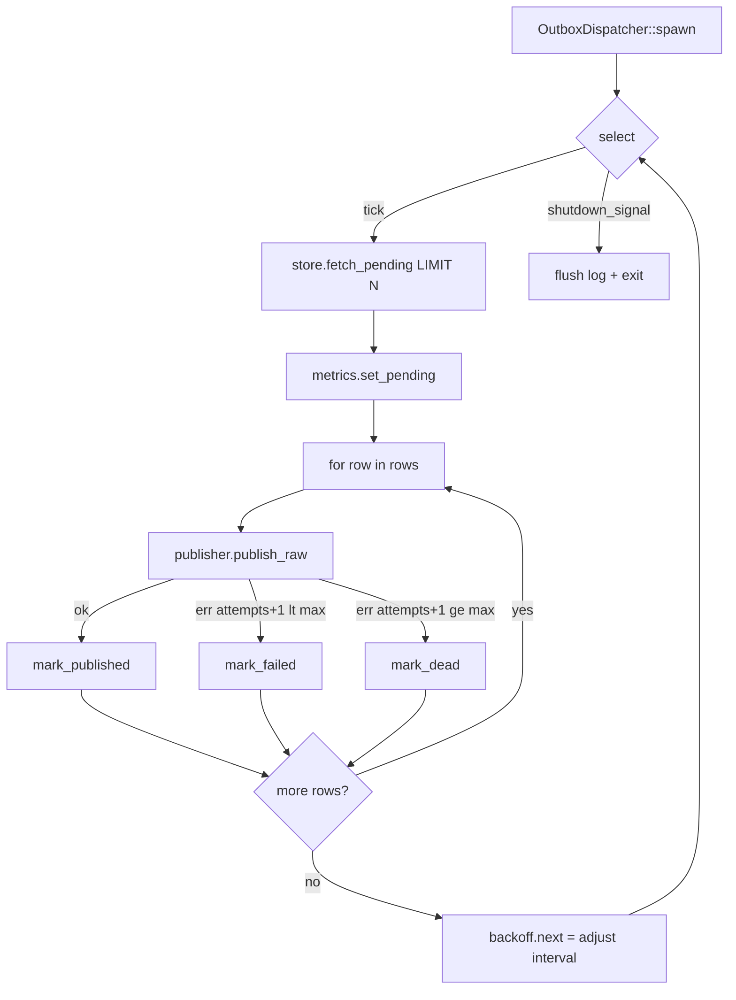

# Outbox Dispatcher (poll + relay loop) — Design

**Status:** Proposed
**Crate:** `bus-outbox` (feature `postgres-outbox`)
**Related:** README §5, Roadmap "Outbox dispatcher (poll + relay loop) — 🚧 In progress"

## 1. Context and goal

`eventbus-rs` implements the transactional outbox pattern: a business write and
an `INSERT INTO eventbus_outbox` commit in a single Postgres transaction. A
separate process must later read pending rows and publish them to NATS
JetStream. That process is the **outbox dispatcher**, and this spec defines it.

Today, `bus-outbox::dispatcher` is a single-line placeholder. The store
(`PostgresOutboxStore`) already exposes `insert`, `fetch_pending`,
`mark_published`, and `mark_failed`; the missing piece is the loop that drives
them.

### Goals (v1)

- Ship an `OutboxDispatcher` that a service can spawn in-process with three
  dependencies: an `OutboxStore`, a raw publisher, and an optional config.
- Safe to run with multiple replicas: duplicates are acceptable and handled by
  NATS `Nats-Msg-Id` dedup + consumer-side inbox idempotency.
- Graceful shutdown bounded by a configurable timeout.
- Hooks for metrics so `bus-telemetry` can plug in later without API churn.
- Keep `bus-outbox` free of any dependency on `bus-nats`.

### Non-goals (v1)

- A standalone `bus-outbox-dispatcher` binary. Deferred.
- Built-in circuit breaker reusing `bus-nats::CircuitBreaker`. Deferred to
  v1.1 — replaced by a simple adaptive poll-interval.
- A separate `eventbus_outbox_dead` table. Deferred — poison rows are marked
  with `failed_at` in place.
- Distinguishing transient vs permanent publish errors. All failures count
  against `attempts` uniformly.
- Concurrent publishes per batch. V1 is sequential to preserve `created_at`
  order.

## 2. Architecture and crate boundaries

```
bus-core
  └── publisher.rs
        ├── trait Publisher          (existing, typed <E: Event>)
        └── trait OutboxPublisher    (NEW, object-safe, raw bytes)

bus-nats
  └── publisher.rs
        └── impl OutboxPublisher for NatsPublisher     (NEW)

bus-outbox
  ├── store.rs            (trait OutboxStore + new method mark_dead)
  ├── postgres.rs         (impl mark_dead + updated fetch_pending query)
  ├── migrations/004_outbox_failed_at.sql   (NEW)
  └── dispatcher/
        ├── mod.rs        (OutboxDispatcher, DispatcherHandle, re-exports)
        ├── config.rs     (OutboxDispatcherConfig + validate)
        ├── run_loop.rs   (poll + sequential relay)
        ├── metrics.rs    (DispatcherMetrics trait + NoopMetrics)
        └── backoff.rs    (adaptive poll-interval state)
```

Dependency direction:

```
bus-outbox ── depends ──▶ bus-core
bus-nats   ── depends ──▶ bus-core
event-bus  ── depends ──▶ bus-outbox, bus-nats
```

`bus-outbox` does not depend on `bus-nats`. A service (or the `event-bus`
facade) constructs an `Arc<dyn OutboxPublisher>` from a `NatsPublisher` and
passes it to the dispatcher. This keeps the crate graph acyclic and lets other
transports implement the trait in the future.

The entire dispatcher module is gated behind `#[cfg(feature = "postgres-outbox")]`,
matching the existing convention in `bus-outbox`.

## 3. Public API

### 3.1 `bus-core` — new trait `OutboxPublisher`

```rust
#[async_trait]
pub trait OutboxPublisher: Send + Sync {
    async fn publish_raw(
        &self,
        subject: &str,
        payload: &[u8],
        headers: &serde_json::Value,
        msg_id: &MessageId,
    ) -> Result<PubReceipt, BusError>;
}
```

Object-safe (no generics, no `impl Trait`) so it can be held as
`Arc<dyn OutboxPublisher>`. `headers` is `serde_json::Value` because the
outbox stores headers as JSONB; implementations translate to their wire format.
The implementation is responsible for setting `Nats-Msg-Id = msg_id` on the
message so broker-side dedup works.

### 3.2 `bus-nats` — implement `OutboxPublisher` for `NatsPublisher`

Uses the existing `NatsClient.js.publish_with_headers(...)` path. If `headers`
is a JSON object, each string-valued entry is added to an `async_nats::HeaderMap`;
non-string values (nested objects, arrays, numbers, booleans, null) are dropped
and logged once per dropped key via `tracing::warn!`. `Nats-Msg-Id` is always
set from `msg_id` and overrides any conflicting entry in `headers`.

### 3.3 `bus-outbox` — `OutboxStore` trait changes

Add one method to the trait:

```rust
async fn mark_dead(&self, id: &MessageId) -> Result<(), BusError>;
```

Update the existing `fetch_pending` query to also exclude dead rows:

```sql
WHERE published_at IS NULL AND failed_at IS NULL
```

The trait change is breaking, but `bus-outbox` is pre-1.0 and has one known
implementation (`PostgresOutboxStore`); we update it in the same PR.

### 3.4 `bus-outbox` — dispatcher types

```rust
pub struct OutboxDispatcherConfig {
    pub poll_interval:    Duration, // default 250 ms
    pub batch_size:       u32,      // default 100
    pub max_attempts:     i32,      // default 10
    pub max_backoff:      Duration, // default 5 s (adaptive cap)
    pub shutdown_timeout: Duration, // default 30 s
}

impl OutboxDispatcherConfig {
    /// Invariants:
    /// - `poll_interval      >= 10 ms`
    /// - `batch_size         >= 1`
    /// - `max_attempts       >= 1`
    /// - `max_backoff        >= poll_interval`
    /// - `shutdown_timeout   >= 100 ms`
    pub fn validate(&self) -> Result<(), BusError>;
}

pub struct OutboxDispatcher<S: OutboxStore> {
    store:     Arc<S>,
    publisher: Arc<dyn OutboxPublisher>,
    metrics:   Arc<dyn DispatcherMetrics>,
    config:    OutboxDispatcherConfig,
}

impl<S: OutboxStore + 'static> OutboxDispatcher<S> {
    pub fn new(store: Arc<S>, publisher: Arc<dyn OutboxPublisher>) -> Self;
    pub fn with_config(self, cfg: OutboxDispatcherConfig) -> Self;
    pub fn with_metrics(self, metrics: Arc<dyn DispatcherMetrics>) -> Self;
    pub fn spawn(self) -> Result<DispatcherHandle, BusError>;
}

pub struct DispatcherHandle {
    cancel: tokio_util::sync::CancellationToken,
    join:   tokio::task::JoinHandle<()>,
    shutdown_timeout: Duration,
}

impl DispatcherHandle {
    pub async fn shutdown(self) -> Result<(), BusError>;
    pub fn abort(self);
}

impl Drop for DispatcherHandle {
    // Best-effort cancel; does not wait.
}
```

`spawn()` validates the config and returns `BusError::Outbox` on invalid
values. The worker task is bounded by `shutdown_timeout`: after that, `shutdown`
returns a timeout error and the task is aborted.

### 3.5 `DispatcherMetrics` hook

```rust
pub trait DispatcherMetrics: Send + Sync {
    fn inc_published(&self, _subject: &str) {}
    fn inc_failed(&self, _subject: &str, _transient: bool) {}
    fn inc_dead(&self, _subject: &str) {}
    fn set_pending(&self, _count: u64) {}
    fn record_batch_duration(&self, _d: Duration) {}
}

pub struct NoopMetrics;
impl DispatcherMetrics for NoopMetrics {}
```

V1 ships `NoopMetrics` and relies on `tracing` events for observability. The
`transient` flag is always `true` in v1; it exists now so `bus-telemetry` (and
a future heuristic) can use it without a breaking change.

## 4. Data flow



### 4.1 Per-row handling

1. `publisher.publish_raw(subject, payload, headers, msg_id)`.
2. On `Ok`: `store.mark_published(id)`; emit `tracing::info!` with
   `outcome = "published"`; `metrics.inc_published`.
3. On `Err`:
   - `attempts_next = row.attempts + 1`.
   - If `attempts_next >= config.max_attempts` → `store.mark_dead(id)`;
     `metrics.inc_dead`; `tracing::error!` with `outcome = "dead"`.
   - Otherwise → `store.mark_failed(id, &err_string)`; `metrics.inc_failed`;
     `tracing::warn!` with `outcome = "failed"`.

No long database transaction wraps the publish: writing `mark_published` after
NATS returns success leaves a small window where a crash produces a duplicate
on the next tick. That duplicate is accepted by design and absorbed by NATS
`Nats-Msg-Id` dedup plus consumer-side inbox idempotency.

### 4.2 Adaptive poll-interval

`backoff.rs` holds `{ base, current, max }`. After each batch:

- **Empty batch** (no rows returned): `current = base`.
- **All failed** (`published == 0 && failed > 0`):
  `current = min(current * 2, max)`.
- **At least one published**: `current = base`.

This is not a circuit breaker. It is three rules over one `Duration`, enough
to prevent tight-looping on a DB that keeps returning pending rows while NATS
is down.

### 4.3 Shutdown

- `DispatcherHandle::shutdown().await` sets the cancellation token and awaits
  the worker with `tokio::time::timeout(shutdown_timeout, ...)`.
- The token is checked in two places: **before fetching a new batch** and
  **between rows inside the for-loop**. It is never observed mid-row, so the
  worst-case in-flight work on cancellation is one publish + one UPDATE.
- On timeout: the task is aborted and `shutdown` returns
  `BusError::Outbox("shutdown timeout")`.
- `Drop` signals the token but does not wait, matching `SubscriptionHandle`.

## 5. Schema changes

New migration file `crates/bus-outbox/migrations/004_outbox_failed_at.sql`:

```sql
ALTER TABLE eventbus_outbox
  ADD COLUMN IF NOT EXISTS failed_at TIMESTAMPTZ NULL;

DROP  INDEX IF EXISTS eventbus_outbox_pending_idx;
CREATE INDEX IF NOT EXISTS eventbus_outbox_pending_idx
  ON eventbus_outbox (created_at)
  WHERE published_at IS NULL AND failed_at IS NULL;
```

The migration is idempotent. It preserves the existing partial index pattern.
`run_migrations` must be extended to run this file after `003_sagas.sql`.

## 6. Error handling and edge cases

| Layer | Error | Dispatcher behavior |
|---|---|---|
| `store.fetch_pending` | `BusError::Outbox` | log error; adaptive backoff; loop |
| `publisher.publish_raw` | `BusError::Publish` / `::Nats` | attempts++ → `mark_failed` or `mark_dead` |
| `store.mark_published` after OK publish | `BusError::Outbox` | log; skip to next row; row will be republished, NATS dedup filters |
| `store.mark_failed` / `mark_dead` | `BusError::Outbox` | log; skip to next row |
| Panic in the loop | — | `JoinHandle` sees error; `shutdown()` returns it |

Specific cases:

1. **Crash between OK publish and `mark_published`** → row stays pending; next
   tick republishes; NATS `Nats-Msg-Id` dedup (default 5-minute window) filters.
2. **`ack_future` timeout from `async-nats`** → mapped to `BusError::Publish`
   → attempts++; dedup filters on retry.
3. **Payload corrupt in DB** → sent as-is; no validation in dispatcher.
4. **Clock skew between replicas** → no cross-replica time comparisons;
   `now()` is only used server-side in Postgres.
5. **Busy table** → other replicas' SKIP LOCKED skips over in-batch rows; with
   `batch_size=100` collisions are rare.
6. **`DispatcherHandle` dropped without `shutdown()`** → `Drop` signals cancel;
   loop exits on next tick.
7. **Invalid config** (`max_attempts = 0`, `poll_interval = 0`, etc.) → `spawn`
   returns `BusError::Outbox` before starting the task.
8. **Shutdown mid-batch** → current row completes; remaining rows re-enter on
   next startup; bounded by `shutdown_timeout`.
9. **Postgres pool exhausted** → `fetch_pending` fails → backoff; app keeps
   running.

### 6.1 Tracing events

Every row emits exactly one event:

```rust
tracing::info!(
    target: "eventbus::outbox::dispatcher",
    msg_id = %row.id,
    subject = %row.subject,
    attempts = row.attempts + 1,
    outcome = "published" | "failed" | "dead",
    error = ?e,
);
```

The batch is wrapped in `tracing::info_span!("outbox.batch", batch_size, duration_ms)`.

## 7. Testing

### 7.1 Unit tests (no containers)

Use in-file mock implementations of `OutboxStore` and `OutboxPublisher`:

- `fake_store` — `Arc<Mutex<Vec<OutboxRow>>>` with behavior per trait method.
- `fake_publisher` with variants: `AlwaysOk`, `AlwaysErr(String)`,
  `SeqFail { n_fails }`, `SlowFor { ms }`; records every call.

Cases:

1. `publishes_in_order`
2. `retries_failed_row_next_tick`
3. `marks_dead_after_max_attempts`
4. `adaptive_backoff_doubles_on_full_fail`
5. `adaptive_backoff_resets_on_success`
6. `graceful_shutdown_waits_for_inflight_row`
7. `shutdown_timeout_aborts`
8. `drop_handle_stops_loop`
9. `invalid_config_rejected`
10. `metrics_hook_called`

Timing-sensitive tests use `tokio::time::pause()` and `advance()`.

### 7.2 Integration tests (`crates/bus-outbox/tests/dispatcher_test.rs`)

Two containers via `testcontainers` + `testcontainers-modules` (already in
workspace deps):

- `end_to_end_publishes_outbox_to_nats` — insert 5 events, spawn dispatcher,
  consume from NATS, assert all 5 rows transition to `published_at != NULL`.
- `dedup_prevents_duplicate_delivery` — after a successful publish, reset
  `published_at = NULL` to simulate a crash, tick again, assert the consumer
  still receives the message exactly once.
- `dead_row_after_publish_failure` *(optional)* — insert event to a subject
  that does not match the stream filter, `max_attempts=2`, assert `failed_at`
  is set and consumer never receives it.

### 7.3 Migration test

Run `run_migrations` on a fresh DB and on a DB already carrying the old
`001_outbox.sql` schema; assert the resulting schema is identical and the
partial index uses both `published_at IS NULL` and `failed_at IS NULL`.

### 7.4 CI and feature flags

All new tests require `--features postgres-outbox`. The integration test
follows the existing pattern in `crates/bus-outbox/tests/outbox_test.rs`
(testcontainers unconditional); no new CI flag.

## 8. Defaults (summary)

| Setting | Default |
|---|---|
| `poll_interval` | 250 ms |
| `batch_size` | 100 |
| `max_attempts` | 10 |
| `max_backoff` | 5 s |
| `shutdown_timeout` | 30 s |

## 9. New dependencies

- `tokio-util` (workspace) with the `rt` feature for `CancellationToken`.
- `tokio` test-util feature enabled under `#[cfg(test)]` of `bus-outbox` for
  `tokio::time::pause()` / `advance()` in unit tests.

No new dependencies in `bus-core` or `bus-nats`.

## 10. Out of scope (for future iterations)

- Standalone sidecar binary (`bus-outbox-dispatcher`).
- Circuit breaker reusing `bus-nats::CircuitBreaker`.
- Separate `eventbus_outbox_dead` table for poison rows.
- Concurrent publishes within a batch (semaphore-bounded `FuturesUnordered`).
- Exponential per-row backoff with `next_attempt_at`.
- Transient vs permanent classification of publish errors.
- Generalizing `OutboxStore` over `sqlx::Database` (already a separate roadmap
  item).
