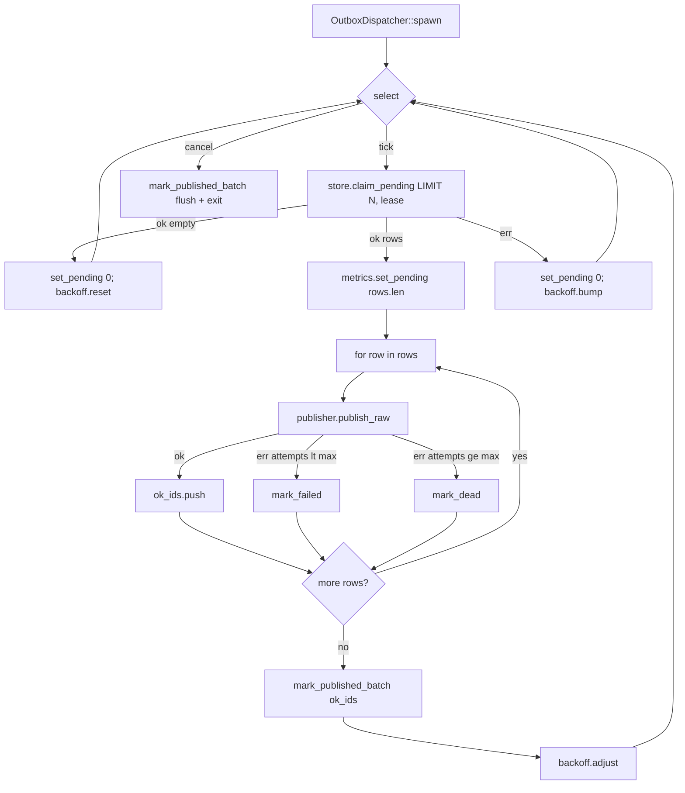

# Outbox Dispatcher (poll + relay loop) — Design

**Status:** Proposed
**Revised:** 2026-05-05 (post-review hardening — lease-based claim, dead-row recovery, header security, broader test catalogue)
**Crate:** `bus-outbox` (feature `postgres-outbox`)
**Related:** README §5, Roadmap "Outbox dispatcher (poll + relay loop) — 🚧 In progress"

## 1. Context and goal

`eventbus-rs` implements the transactional outbox pattern: a business write and
an `INSERT INTO eventbus_outbox` commit in a single Postgres transaction. A
separate process must later read pending rows and publish them to NATS
JetStream. That process is the **outbox dispatcher**, and this spec defines it.

Today, `bus-outbox::dispatcher` is a single-line placeholder. The store
(`PostgresOutboxStore`) already exposes `insert`, `fetch_pending`,
`mark_published`, and `mark_failed`, but `fetch_pending` runs as a single
statement against the pool, so its `FOR UPDATE SKIP LOCKED` lock is released
the moment the SELECT returns — two replicas can claim the same row, and
follow-up `mark_failed`s race (lost-update on `attempts`). v1 fixes that with
a lease-based claim and a small set of related hardenings called out below.

### Goals (v1)

- Ship an `OutboxDispatcher` that a service can spawn in-process with three
  dependencies: an `OutboxStore`, a raw publisher, and an optional config.
- **Safe to run with multiple replicas without lost-update on `attempts`.** Two
  replicas never claim the same row in the same lease window. Duplicates that
  do occur (e.g. crash mid-publish) are absorbed by NATS `Nats-Msg-Id` dedup +
  consumer-side inbox idempotency.
- Recover crashed workers automatically via lease expiry — no manual
  intervention to un-stick rows.
- Operator escape hatch for poison rows: `list_dead` + `requeue_dead`.
- Header passing that does not let user-supplied JSONB inject JetStream control
  headers (`Nats-Expected-*`, `Nats-Rollup`, …).
- Graceful shutdown bounded by a configurable timeout.
- Hooks for metrics so `bus-telemetry` can plug in later without API churn.
- Keep `bus-outbox` free of any dependency on `bus-nats`.

### Non-goals (v1)

- A standalone `bus-outbox-dispatcher` binary. Deferred.
- Built-in circuit breaker reusing `bus-nats::CircuitBreaker`. Deferred to
  v1.1 — replaced by a simple adaptive poll-interval.
- A separate `eventbus_outbox_dead` table. Deferred — poison rows are marked
  with `failed_at` in place; `list_dead`/`requeue_dead` provide the escape
  hatch.
- Per-row exponential backoff with `next_attempt_at`. Deferred — a single bad
  row will tight-loop at `poll_interval` until it reaches `max_attempts`. See
  §10.
- Notify-on-insert (LISTEN/NOTIFY or in-process `Notify`) to drop tail
  latency below `poll_interval`. Deferred — operators wanting lower latency
  can shrink `poll_interval`.
- Distinguishing transient vs permanent publish errors. All failures count
  against `attempts` uniformly.
- Concurrent publishes per batch. v1 is sequential to preserve `created_at`
  order.
- Standalone CLI/admin tooling for `list_dead`/`requeue_dead`. Deferred —
  v1 ships only the trait API.

## 2. Architecture and crate boundaries

```
bus-core
  └── publisher.rs
        ├── trait Publisher          (existing, typed <E: Event>)
        └── trait OutboxPublisher    (NEW, object-safe, raw bytes)

bus-nats
  └── publisher.rs
        └── impl OutboxPublisher for NatsPublisher     (NEW)

bus-outbox
  ├── store.rs            (trait OutboxStore — claim_pending replaces
  │                        fetch_pending; new mark_dead, mark_published_batch,
  │                        list_dead, requeue_dead; DeadRow type)
  ├── postgres.rs         (impls above)
  ├── migrations/004_outbox_lease_and_dead.sql   (NEW)
  └── dispatcher/
        ├── mod.rs        (OutboxDispatcher, DispatcherHandle, re-exports)
        ├── config.rs     (OutboxDispatcherConfig + Default + validate)
        ├── run_loop.rs   (claim + sequential relay + batched mark_published)
        ├── metrics.rs    (DispatcherMetrics trait + NoopMetrics)
        └── backoff.rs    (adaptive poll-interval state)
```

Dependency direction:

```
bus-outbox ── depends ──▶ bus-core
bus-nats   ── depends ──▶ bus-core
event-bus  ── depends ──▶ bus-outbox, bus-nats
```

`bus-outbox` does not depend on `bus-nats`. A service (or the `event-bus`
facade) constructs an `Arc<dyn OutboxPublisher>` from a `NatsPublisher` and
passes it to the dispatcher. This keeps the crate graph acyclic and lets other
transports implement the trait in the future.

The entire dispatcher module is gated behind `#[cfg(feature = "postgres-outbox")]`,
matching the existing convention in `bus-outbox`.

## 3. Public API

### 3.1 `bus-core` — new trait `OutboxPublisher`

```rust
#[async_trait]
pub trait OutboxPublisher: Send + Sync {
    async fn publish_raw(
        &self,
        subject: &str,
        payload: &[u8],
        headers: &serde_json::Value,
        msg_id: &MessageId,
    ) -> Result<PubReceipt, BusError>;
}
```

Object-safe (no generics, no `impl Trait`) so it can be held as
`Arc<dyn OutboxPublisher>`. `headers` is `serde_json::Value` because the
outbox stores headers as JSONB; implementations translate to their wire format
following the contract in §3.2.

### 3.2 `bus-nats` — implement `OutboxPublisher` for `NatsPublisher`

Uses the existing `NatsClient.js.publish_with_headers(...)` path. Header
translation is contract-defined (consumers and tests rely on this exact
behavior):

1. **`Nats-*` namespace allow-list (security).** Any key in `headers` whose name
   starts with `Nats-` is **stripped** before insertion into the wire
   `HeaderMap`, with a `tracing::warn!` once per stripped key per process.
   This prevents an upstream producer from injecting JetStream control
   headers (`Nats-Expected-Stream`, `Nats-Expected-Last-Sequence`,
   `Nats-Rollup`, `Nats-Msg-Ttl`, …) via the JSONB column.
2. **Non-`Nats-*` keys.** String values pass through. `bool` and `number`
   values are coerced via `to_string()` (so `42` → `"42"`, `true` → `"true"`).
   `null`, objects, and arrays are dropped, with a `tracing::warn!` once per
   dropped key.
3. **`Nats-Msg-Id` is set last** on the `HeaderMap` from the `MessageId`
   parameter, so it always wins over anything user code may have tried to
   place there. (Step 1 above already strips it from the user payload, but
   step 3 is the load-bearing one for broker-side dedup.)

### 3.3 `bus-outbox` — `OutboxStore` trait (breaking changes)

```rust
#[async_trait]
pub trait OutboxStore: Send + Sync {
    /// Persist a row inside the caller's transaction.
    async fn insert<'tx, E: Event>(
        &self,
        tx: &mut Transaction<'tx, Postgres>,
        event: &E,
    ) -> Result<(), BusError>;

    /// Atomically claim up to `limit` pending rows for `lease`.
    ///
    /// In a single statement: select rows that are not published, not dead,
    /// and whose lease (if any) has expired; under FOR UPDATE SKIP LOCKED
    /// set `claimed_until = now() + lease`, increment `attempts`, RETURNING
    /// row data. Because it is a single statement the lock need not be held
    /// by the caller — the row's lease is what protects it from re-claim.
    async fn claim_pending(
        &self,
        limit: u32,
        lease: Duration,
    ) -> Result<Vec<OutboxRow>, BusError>;

    /// Mark a contiguous set of rows as published in one round-trip.
    async fn mark_published_batch(&self, ids: &[MessageId]) -> Result<(), BusError>;

    /// Record an error for a row. Does NOT touch `attempts` (already
    /// incremented at claim time).
    async fn mark_failed(&self, id: &MessageId, error: &str) -> Result<(), BusError>;

    /// Mark a row as poison: sets `failed_at = now()`. Excluded from
    /// future claims until `requeue_dead`.
    async fn mark_dead(&self, id: &MessageId) -> Result<(), BusError>;

    /// Operator-facing: page through dead rows for inspection.
    async fn list_dead(
        &self,
        limit: u32,
        offset: u32,
    ) -> Result<Vec<DeadRow>, BusError>;

    /// Operator-facing: clear `failed_at`, `attempts`, `last_error` on the
    /// listed rows so the dispatcher will pick them up again. Returns the
    /// number of rows actually re-queued.
    async fn requeue_dead(&self, ids: &[MessageId]) -> Result<u64, BusError>;
}

pub struct OutboxRow {
    pub id:       MessageId,
    pub subject:  String,
    pub payload:  Vec<u8>,
    pub headers:  serde_json::Value,
    pub attempts: i32, // value AFTER claim_pending's atomic increment
}

pub struct DeadRow {
    pub id:         MessageId,
    pub subject:    String,
    pub attempts:   i32,
    pub last_error: Option<String>,
    pub failed_at:  chrono::DateTime<chrono::Utc>,
}
```

Differences from the current pre-1.0 trait:

- `fetch_pending` is replaced by `claim_pending` (lease-based, single
  statement, locks not held by caller).
- `mark_published(id)` becomes `mark_published_batch(&[id])`.
- `mark_failed` no longer touches `attempts`.
- `mark_dead`, `list_dead`, `requeue_dead` are new.

`bus-outbox` is pre-1.0 with one known implementation
(`PostgresOutboxStore`); the trait change ships in the same PR.

### 3.4 `PostgresOutboxStore` — claim query

```sql
WITH claimed AS (
  SELECT id FROM eventbus_outbox
  WHERE published_at IS NULL
    AND failed_at IS NULL
    AND (claimed_until IS NULL OR claimed_until < now())
  ORDER BY created_at
  LIMIT $1
  FOR UPDATE SKIP LOCKED
)
UPDATE eventbus_outbox o
  SET claimed_until = now() + $2::interval,
      attempts      = attempts + 1
  FROM claimed
  WHERE o.id = claimed.id
  RETURNING o.id, o.subject, o.payload, o.headers, o.attempts;
```

The `SKIP LOCKED` clause is what keeps two replicas from picking the same row
in the inner CTE. Since the outer UPDATE moves `claimed_until` into the future
in the same statement, by the time the lock releases the row already looks
"taken" to any other replica.

`mark_published_batch` is `UPDATE eventbus_outbox SET published_at = now() WHERE id = ANY($1)`.

`requeue_dead` is `UPDATE eventbus_outbox SET failed_at = NULL, attempts = 0,
last_error = NULL, claimed_until = NULL WHERE id = ANY($1) AND failed_at IS NOT NULL`.

### 3.5 `bus-outbox` — dispatcher types

```rust
pub struct OutboxDispatcherConfig {
    pub poll_interval:    Duration, // default 250 ms
    pub batch_size:       u32,      // default 100
    pub max_attempts:     i32,      // default 10
    pub max_backoff:      Duration, // default 5 s   (adaptive cap)
    pub lease_duration:   Duration, // default 60 s
    pub shutdown_timeout: Duration, // default 30 s
}

impl Default for OutboxDispatcherConfig { /* values above */ }

impl OutboxDispatcherConfig {
    /// Invariants:
    /// - `poll_interval      >= 10 ms`
    /// - `batch_size         >= 1`
    /// - `max_attempts       >= 1`
    /// - `max_backoff        >= poll_interval`
    /// - `max_backoff        <= lease_duration / 2`
    /// - `shutdown_timeout   >= 1 s`
    /// - `lease_duration     >= 2 * shutdown_timeout`
    pub fn validate(&self) -> Result<(), BusError>;
}

pub struct OutboxDispatcher<S: OutboxStore> {
    store:     Arc<S>,
    publisher: Arc<dyn OutboxPublisher>,
    metrics:   Arc<dyn DispatcherMetrics>,
    config:    OutboxDispatcherConfig,
}

impl<S: OutboxStore + 'static> OutboxDispatcher<S> {
    pub fn new(store: Arc<S>, publisher: Arc<dyn OutboxPublisher>) -> Self;
    pub fn with_config(self, cfg: OutboxDispatcherConfig) -> Self;
    pub fn with_metrics(self, metrics: Arc<dyn DispatcherMetrics>) -> Self;
    pub fn spawn(self) -> Result<DispatcherHandle, BusError>;
}

pub struct DispatcherHandle {
    cancel: tokio_util::sync::CancellationToken,
    join:   tokio::task::JoinHandle<()>,
    shutdown_timeout: Duration,
}

impl DispatcherHandle {
    pub async fn shutdown(self) -> Result<(), BusError>;
    pub fn abort(self);
}

impl Drop for DispatcherHandle {
    // Best-effort cancel; does not wait.
}
```

`spawn()` validates the config and returns `BusError::Outbox` on invalid
values. The worker task is bounded by `shutdown_timeout`: after that, `shutdown`
returns a timeout error and the task is aborted.

The `lease_duration >= 2 * shutdown_timeout` invariant guarantees that a
graceful shutdown finishes before the lease can be stolen by another replica:
the worker can safely drain its in-flight row + final `mark_published_batch`
without racing a re-claim.

### 3.6 `DispatcherMetrics` hook

```rust
pub trait DispatcherMetrics: Send + Sync {
    fn inc_published(&self, _subject: &str) {}
    fn inc_failed(&self, _subject: &str, _transient: bool) {}
    fn inc_dead(&self, _subject: &str) {}
    fn set_pending(&self, _count: u64) {}
    fn record_batch_duration(&self, _d: Duration) {}
}

pub struct NoopMetrics;
impl DispatcherMetrics for NoopMetrics {}
```

v1 ships `NoopMetrics` and relies on `tracing` events for observability. The
`transient` flag is always `true` in v1; it exists now so `bus-telemetry` (and
a future heuristic) can use it without a breaking change.

## 4. Data flow



### 4.1 Per-row handling

`attempts` is incremented atomically inside `claim_pending`. The dispatcher
treats `row.attempts` as the **post-increment** value:

1. `publisher.publish_raw(subject, payload, headers, msg_id)`.
2. On `Ok`: push `row.id` into the in-memory `ok_ids` Vec; emit `tracing::info!`
   with `outcome = "published"`; `metrics.inc_published`.
3. On `Err`:
   - If `row.attempts >= config.max_attempts` → `store.mark_dead(id)`;
     `metrics.inc_dead`; `tracing::error!` with `outcome = "dead"`.
   - Otherwise → `store.mark_failed(id, &err_string)`; `metrics.inc_failed`;
     `tracing::warn!` with `outcome = "failed"`. The lease will expire
     naturally (caller does **not** reset `claimed_until`), so the row is
     picked up again on a future tick.

After the row loop, if `ok_ids` is non-empty, the dispatcher calls
`store.mark_published_batch(&ok_ids)` — one round-trip per batch.

No long database transaction wraps the publish: writing `mark_published_batch`
after NATS returns success leaves a small window where a crash produces a
duplicate on the next tick. That duplicate is accepted by design and absorbed
by NATS `Nats-Msg-Id` dedup plus consumer-side inbox idempotency.

### 4.2 Adaptive poll-interval

`backoff.rs` holds `{ base, current, max }`. After each batch:

- **Empty batch** (no rows returned): `current = base`.
- **All failed** (`published == 0 && failed > 0`):
  `current = min(current * 2, max)`.
- **At least one published**: `current = base`.
- **`claim_pending` returned an error**: `current = min(current * 2, max)`;
  `metrics.set_pending(0)`.

This is not a circuit breaker. It is four rules over one `Duration`, enough
to prevent tight-looping on a DB that keeps returning pending rows while NATS
is down.

Known limitation (deferred to v1.1): one persistently-failing row with 99
healthy ones will reset `current` to `base` every tick, so the dispatcher
tight-loops at `poll_interval` over that bad row until it hits
`max_attempts`. Per-row `next_attempt_at` would fix this — see §10.

### 4.3 Shutdown

- `DispatcherHandle::shutdown().await` sets the cancellation token and awaits
  the worker with `tokio::time::timeout(shutdown_timeout, ...)`.
- The token is checked in two places: **before claiming a new batch** and
  **between rows inside the for-loop**.
- After the for-loop exits — whether due to "no more rows" or due to
  cancellation — the dispatcher **always** flushes any accumulated `ok_ids`
  via `mark_published_batch`. This guarantees that rows already accepted by
  NATS are recorded as published even if shutdown lands mid-batch.
- Worst-case in-flight work on cancellation is one publish + one `mark_failed`
  (or `mark_dead`) + one `mark_published_batch`.
- On timeout: the task is aborted and `shutdown` returns
  `BusError::Outbox("shutdown timeout")`.
- `Drop` signals the token but does not wait, matching `SubscriptionHandle`.
- The `lease_duration >= 2 * shutdown_timeout` invariant ensures another
  replica cannot steal a row mid-shutdown.

## 5. Schema changes

New migration file `crates/bus-outbox/migrations/004_outbox_lease_and_dead.sql`:

```sql
ALTER TABLE eventbus_outbox
  ADD COLUMN IF NOT EXISTS failed_at      TIMESTAMPTZ NULL,
  ADD COLUMN IF NOT EXISTS claimed_until  TIMESTAMPTZ NULL;

DROP  INDEX IF EXISTS eventbus_outbox_pending_idx;
CREATE INDEX IF NOT EXISTS eventbus_outbox_pending_idx
  ON eventbus_outbox (created_at)
  WHERE published_at IS NULL AND failed_at IS NULL;
```

The migration is idempotent. The partial-index predicate **deliberately omits**
`claimed_until` because Postgres requires partial-index predicates to be
`IMMUTABLE`, and `now()` is `STABLE`. The `claimed_until` filter lives in the
query `WHERE` clause; the index narrows the scan to alive+pending rows
(typically the vast majority), and the planner combines that with an in-row
check on `claimed_until`.

`run_migrations` must be extended to run this file after `003_sagas.sql`.

## 6. Error handling and edge cases

| Layer | Error | Dispatcher behavior |
|---|---|---|
| `store.claim_pending` | `BusError::Outbox` | `metrics.set_pending(0)`; backoff bump; loop |
| `publisher.publish_raw` | `BusError::Publish` / `::Nats` | `attempts` already incremented at claim; route to `mark_failed` or `mark_dead` based on post-increment value |
| `store.mark_published_batch` | `BusError::Outbox` | log; rows keep `claimed_until` until lease expires, then re-claimed and re-published; NATS dedup filters |
| `store.mark_failed` / `mark_dead` | `BusError::Outbox` | log; row will be re-claimed naturally after lease expiry |
| Panic in the loop | — | `JoinHandle` sees error; `shutdown()` returns it |

Specific cases:

1. **Crash between OK publish and `mark_published_batch`** → rows stay
   pending with their `claimed_until` set; once that timestamp passes, another
   replica (or the restarted worker) re-claims and re-publishes. NATS
   `Nats-Msg-Id` dedup (default 5-minute window) filters the duplicate.
2. **`ack_future` timeout from `async-nats`** → mapped to `BusError::Publish`
   → `mark_failed`; lease expires; re-publish on next tick; dedup filters.
3. **Payload corrupt in DB** → sent as-is; no validation in dispatcher.
4. **Clock skew between replicas** → `claimed_until` is computed and compared
   server-side in Postgres only, so replicas never compare local clocks.
5. **Two replicas claim simultaneously** → `SKIP LOCKED` in the inner CTE
   guarantees disjoint sets of `id`s; the outer UPDATE moves `claimed_until`
   into the future before the implicit transaction commits, so the released
   lock no longer matters.
6. **`DispatcherHandle` dropped without `shutdown()`** → `Drop` signals
   cancel; loop exits on next tick; in-flight rows time out via the lease.
7. **Invalid config** (`lease_duration < 2 * shutdown_timeout`,
   `max_attempts = 0`, …) → `spawn` returns `BusError::Outbox` before
   starting the task.
8. **Shutdown mid-batch** → cancel checked between rows + before flush; the
   in-flight row + flush complete; remaining rows re-enter on next startup
   bounded by `shutdown_timeout`.
9. **Postgres pool exhausted** → `claim_pending` fails → backoff; app keeps
   running.
10. **Operator manually re-queues a dead row** → `requeue_dead([id])` clears
    `failed_at`/`attempts`/`last_error`; row appears in next claim;
    `attempts` starts again at 0 + 1 = 1.

### 6.1 Tracing events

Every row emits exactly one event:

```rust
tracing::info!(
    target: "eventbus::outbox::dispatcher",
    msg_id = %row.id,
    subject = %row.subject,
    attempts = row.attempts,                  // already post-increment
    outcome = "published" | "failed" | "dead",
    error = ?e,
);
```

The batch is wrapped in `tracing::info_span!("outbox.batch", batch_size,
duration_ms = tracing::field::Empty)`; `duration_ms` is recorded with
`span.record(...)` after the batch finishes.

## 7. Testing

### 7.1 Unit tests (no containers)

Use in-file mock implementations of `OutboxStore` and `OutboxPublisher`:

- `fake_store` — `Arc<Mutex<Vec<OutboxRow>>>` with behavior per trait method,
  including a settable `claimed_until` so lease-expiry tests can fast-forward.
- `fake_publisher` with variants: `AlwaysOk`, `AlwaysErr(String)`,
  `SeqFail { n_fails }`, `SlowFor { ms }`; records every call.

Cases:

1. `publishes_in_order`
2. `failed_row_keeps_attempts_from_claim` — assert `mark_failed` does not
   touch `attempts`; only `claim_pending` does.
3. `marks_dead_after_max_attempts` — uses post-increment value from claim.
4. `mark_published_batch_called_once_per_batch` — assert one batched
   round-trip, not N per-row calls.
5. `adaptive_backoff_doubles_on_full_fail`
6. `adaptive_backoff_resets_on_success`
7. `graceful_shutdown_waits_for_inflight_row_and_flushes_batch`
8. `shutdown_timeout_aborts`
9. `drop_handle_stops_loop`
10. `invalid_config_rejected` — covers all invariants in §3.5 including
    `lease_duration < 2 * shutdown_timeout` and `max_backoff > lease_duration / 2`.
11. `metrics_set_pending_zero_on_fetch_error`
12. `default_config_passes_validate`

Timing-sensitive tests use `tokio::time::pause()` and `advance()`.

### 7.2 Integration tests (`crates/bus-outbox/tests/dispatcher_test.rs`)

Two containers via `testcontainers` + `testcontainers-modules` (already in
workspace deps).

13. **`end_to_end_publishes_outbox_to_nats`** — insert 5 events, spawn
    dispatcher, consume from NATS, assert all 5 rows transition to
    `published_at != NULL`.
14. **`multi_replica_no_double_publish`** *(required to prove the C1 fix)* —
    spawn 2 dispatchers against the same pool, insert 200 events, run for
    long enough to drain, assert each `subject` arrives at the consumer
    exactly once and every row has `published_at IS NOT NULL`.
15. **`nats_msg_id_overrides_user_header`** — insert event with JSONB
    `headers = {"Nats-Msg-Id": "spoofed"}`; assert the consumer sees the real
    `MessageId`.
16. **`user_headers_pass_through_with_coercion`** —
    `headers = {"trace-id": "abc", "retry-count": 3, "ok": true,
    "nested": {"x":1}, "n": null}`; assert consumer sees `trace-id=abc`,
    `retry-count=3`, `ok=true`, and that `nested`/`n` are dropped (warning
    logged once per key).
17. **`nats_namespace_headers_stripped`** — insert event with
    `headers = {"Nats-Expected-Stream": "EVIL", "Nats-Rollup": "all"}`;
    assert neither header is delivered to the broker.
18. **`crash_mid_batch_replays_via_lease`** — drop the dispatcher between
    publish-OK and `mark_published_batch`; sleep `> lease_duration`; spawn a
    fresh dispatcher; assert the row is published again at the broker but the
    consumer (with inbox idempotency) sees it only once.
19. **`expired_lease_reclaimed_by_other_replica`** — replica A claims with
    `lease=2s` and is paused; after 3s replica B claims; assert B receives
    the same row.
20. **`dead_row_excluded_from_claim`** — set `failed_at = now()` directly;
    `claim_pending` returns empty.
21. **`requeue_dead_resets_failed_at`** — `requeue_dead([id])` returns 1;
    next `claim_pending` includes the row with `attempts = 1` (post-increment
    of the reset 0); `failed_at` and `last_error` are NULL.

### 7.3 Migration test

Run `run_migrations` on:

- A fresh DB → all four migrations apply clean.
- A DB carrying the pre-existing `001_outbox.sql` schema → migrations
  002+003+004 apply without error.

In both cases, assert the resulting partial index uses
`WHERE published_at IS NULL AND failed_at IS NULL` (no `claimed_until` term).

### 7.4 CI and feature flags

All new tests require `--features postgres-outbox`. The integration tests
follow the existing pattern in `crates/bus-outbox/tests/outbox_test.rs`
(testcontainers unconditional); no new CI flag.

## 8. Defaults (summary)

| Setting | Default |
|---|---|
| `poll_interval` | 250 ms |
| `batch_size` | 100 |
| `max_attempts` | 10 |
| `max_backoff` | 5 s |
| `lease_duration` | 60 s |
| `shutdown_timeout` | 30 s |

## 9. New dependencies

- `tokio-util = "0.7"` (workspace) — default features include
  `sync::CancellationToken`. (The earlier draft of this spec listed feature
  `rt`; that feature lives on `tokio`, not `tokio-util`, and is not needed
  here.)
- `tokio` `test-util` feature enabled under `[dev-dependencies]` of
  `bus-outbox` for `tokio::time::pause()` / `advance()` in unit tests.

No new dependencies in `bus-core` or `bus-nats`.

## 10. Out of scope (deferred to future iterations)

- Standalone sidecar binary (`bus-outbox-dispatcher`).
- Standalone CLI/admin tool around `list_dead`/`requeue_dead`.
- Circuit breaker reusing `bus-nats::CircuitBreaker`.
- Separate `eventbus_outbox_dead` table for poison rows.
- Concurrent publishes within a batch (semaphore-bounded `FuturesUnordered`).
- Per-row `next_attempt_at` exponential backoff — would prevent the
  tight-loop-on-one-bad-row failure mode noted in §4.2.
- Notify-on-insert (LISTEN/NOTIFY or in-process `Notify`) to drop tail
  latency below `poll_interval`.
- Batched `mark_failed` (when many rows share an error string).
- Transient vs permanent classification of publish errors.
- Generalizing `OutboxStore` over `sqlx::Database` (already a separate
  roadmap item).
